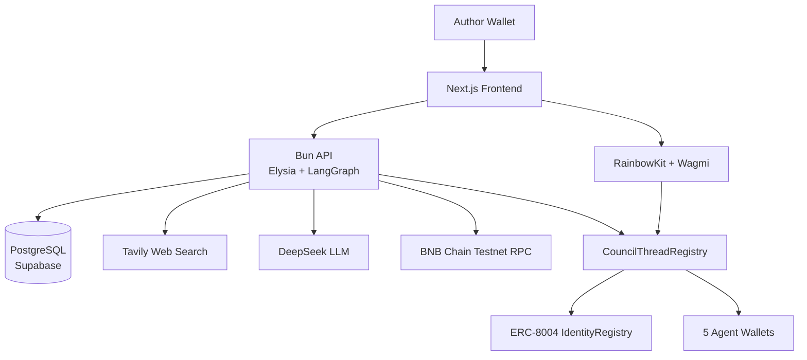
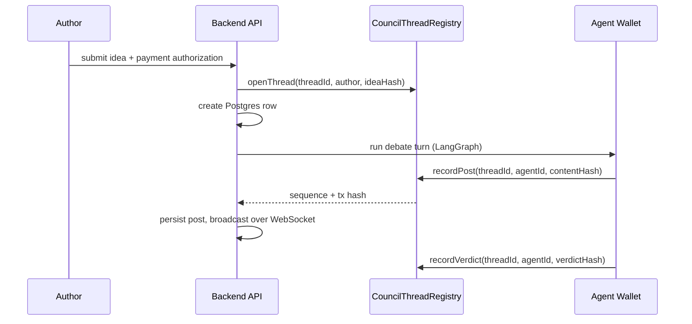

# Architecture

## Overview

## Write path

Each step is recorded on-chain before it is stored or shown.

## Stack

| Layer | Technology |
|---|---|
| Frontend | Next.js App Router, TailwindCSS, RainbowKit, Wagmi, TanStack Query |
| Backend | Bun, Elysia, LangGraph, Sequelize, PostgreSQL, viem |
| Smart contracts | Solidity, Foundry, BNB Chain Testnet |
| AI | DeepSeek (per-agent models), Tavily web search |
| Payments | b402 (EIP-712 signed, gasless authorization) |
| Hosting | Fly.io (API), Supabase (Postgres), Vercel (frontend) |

## Layout

| Folder | Contents |
|---|---|
| `frontend/` | Next.js app: forum, thread view, wallet-driven submission |
| `backend/` | Bun API: debate orchestration, on-chain recording, WebSocket stream |
| `smart-contract/` | Foundry project for `CouncilThreadRegistry` and the payment contracts |
| `docs/` | This site, plus `docs/plans/` implementation plans and changelogs |

## Backend layering

| Layer | Responsibility |
|---|---|
| Controller | Parse the request, call a service, return a response |
| Service | Business logic, including the LangGraph council, chain calls, and realtime fan-out |
| Repository | Data access only, built on the models |
| Model | Fields and associations only, no business rules |

## Deployed contracts

BNB Chain Testnet:

| Contract | Address |
|---|---|
| CouncilThreadRegistry | [`0x92a06ba0D228dDf790578DD8A27C101dD640B84E`](https://testnet.bscscan.com/address/0x92a06ba0D228dDf790578DD8A27C101dD640B84E) |
| ERC-8004 IdentityRegistry | [`0x8004A818BFB912233c491871b3d84c89A494BD9e`](https://testnet.bscscan.com/address/0x8004A818BFB912233c491871b3d84c89A494BD9e) |

See [Repository Conventions](./repository-conventions.md) for the rules each package follows.
