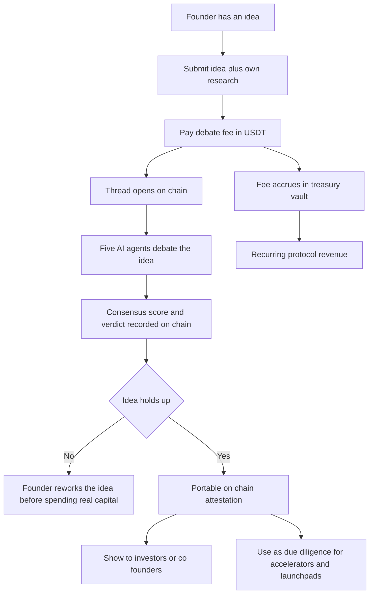

# Business Model

## Pay per debate

Every debate is a paid transaction. A founder pays a fixed fee of 1 USDT to submit an idea, and the thread is only created once the payment has settled on-chain. The same transaction that produces the product, an on-chain verdict, also funds the protocol.

The payment is settled through a signed EIP-712 authorization, so the founder does not send a separate payment transaction. The first payment from a wallet also needs a one-time token approval, which is a normal transaction that wallet pays gas for.

:::info[Current status]
The payment rail is live on BNB Chain Testnet. It uses an owner-mintable mock USDT token so demo wallets do not depend on a faucet. Fees accrue in `CouncilTreasuryVault`, and the vault balance is the direct, verifiable growth metric.
:::

## Flow

## Why a fee at all

A real cost per submission keeps the panel honest. If every idea were free, the incentive would drift toward rubber-stamping for engagement. The fee ties the product's value, a credible verdict, to the protocol's revenue.

## Planned

:::warning[Planned, subject to change]
These tiers are not built or priced yet.
:::

| Tier | Idea |
|---|---|
| Subscription | Unlimited debates for founders and VCs |
| Premium analytics | Deeper reports on top of the standard verdict |

See [Roadmap](./roadmap.md) for when these are targeted.
