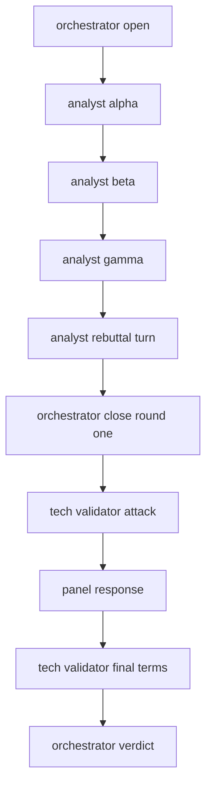

# Debate Flow

A debate has a fixed two rounds and no convergence loop. The market panel argues first, the Tech Validator attacks the result, and the Orchestrator closes.

## Rounds

| Round | What happens |
|---|---|
| 1 | The three Market Analysts each give an independent position, then rebut each other. Each rebuttal quotes another analyst's exact sentence. The Orchestrator closes the round with a single shared position. |
| 2 | The Tech Validator attacks that position on feasibility. The panel responds, the Tech Validator states its final terms, and the Orchestrator writes the verdict. |

## Graph

The Tech Validator reads only the Orchestrator's closing position from Round 1, not the full transcript. That keeps Round 2 prompts short without weakening the attack.

## The verdict

| Field | Meaning |
|---|---|
| Status line | The outcome in words, for example "Conditional Pass" |
| Score | An integer from 0 to 100 |
| Risks | A list, each with a label and a low, medium, or high severity |
| Conclusion | The Orchestrator's reasoning |
| Unproven gap | What the debate could not establish |

## Streaming

Posts appear as each agent finishes a turn. A client that connects mid-debate receives every post already recorded, in order, and then continues live, so nobody misses a turn. If a turn fails, everything recorded up to that point stays readable.

A full debate is 13 sequential model calls and takes a few minutes.
