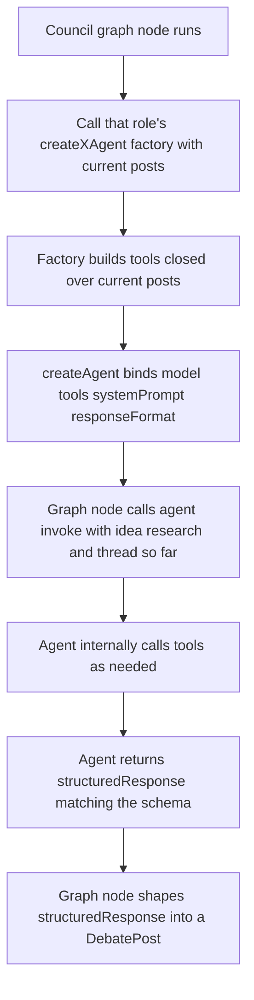

# Council Agentic Tooling

| | |
|---|---|
| **Version** | 2.1 |
| **Status** | Implemented |
| **Date Created** | 2026-09-23 |
| **Last Updated** | 2026-09-24 |

| Version | Date | Change |
|---|---|---|
| 2.1 | 2026-09-24 | **Live-verified end to end.** First live attempt failed: DeepSeek rejected `createAgent`'s default provider-native `responseFormat` (`400 This response_format type is unavailable now`) — fixed by wrapping every `responseFormat` schema in `toolStrategy()` (forces structured output via a synthetic tool call, the same mechanism that already worked for tool-calling in general). Second attempt hit `GraphRecursionError` (limit 25) on the full run; two isolated diagnostics (Orchestrator's open turn, Market Analyst α's rebuttal turn) both completed cleanly in one shot with no wasted tool calls, so a third full run was attempted rather than hunting a phantom bug — it passed, confirming the recursion error was a one-off non-deterministic hiccup, not a structural defect. Full debate: 239s, ~$0.02, score 12/100 total rejection, both the market panel and Tech Validator converged independently on the same constraint (fee cannot fund the build at the pitch's target raise size) — judged as genuinely sharp adversarial debate, at least as good as the version verified in `council-debate-engine.md`. §13 manual verification marked done. |
| 2.0 | 2026-09-23 | **Approach rewritten, invalidating v1.0's design.** v1.0 hand-rolled a tool-calling loop (`bindTools` + a manual step loop + a "submit tool" standing in for structured output). That was rejected as not genuinely agentic — each "agent" was a thin wrapper around one shared generic loop, not an independent unit. Rebuilt on `createAgent` from the `langchain` package: each role folder now constructs and exports a real, independent agent (model + tools + system prompt + a native `responseFormat` schema for structured final output), and the orchestration layer (`council-graph.ts`) only composes and invokes these already-built agents — it does not know how any agent produces its answer. Tools switched from the `tool()` functional helper to `DynamicStructuredTool` instances. `quote_exact_post` and `calculate` are unchanged in purpose. Fully implemented and verified (typecheck clean, all fast/mocked tests passing) in the same session as this rewrite — Draft and Implemented collapse into one entry because the redesign and the build happened together, not in separate passes. |
| 1.0 | 2026-09-23 | Initial draft (hand-rolled tool loop — superseded, see above) |

> **Summary.** `council-debate-engine.md` shipped and is closed — it verified the debate is real, not decorative. But its agents were single-shot structured-output calls with no tool use, and a first attempt at fixing that (v1.0 of this doc) turned out to still not be genuinely agentic — every "agent" was a data bundle fed into one shared loop function, not an independent unit. This version rebuilds each of the five agents as a real, independently-constructed agent (its own model, tools, instructions, and response schema), using a proper agent-construction library rather than hand-rolled tool-call plumbing. A `calculate` tool removes silent arithmetic slips; a `quote_exact_post` tool makes a misquote structurally impossible. This is a refactor of the closed engine's internals, not a reopening of its scope.

---

## 1. Problem Statement

The first agentic pass (v1.0) still failed the actual ask: it added tool-calling, but every agent's "intelligence" ran through one shared `runToolAgent()` function, with each role folder contributing nothing but a mandate string and a schema. That is not five independent agents — it's one mechanism wearing five name tags, which is the exact failure mode the whole project exists to avoid in its own product. Each agent needs to be its own real, independently constructed unit: own model binding, own tools, own instructions, own way of producing a final answer.

---

## 2. Definition of Done

| # | Criterion |
|---|---|
| 1 | `backend/src/service/agent/agents/` contains one folder per role: `orchestrator/`, `market-analyst-alpha/`, `market-analyst-beta/`, `market-analyst-gamma/`, `tech-validator/`. Each has `instruction.ts`, `tools.ts`, `index.ts`. |
| 2 | Each role's `index.ts` constructs and exports its own agent(s) via `createAgent({ model, tools, systemPrompt, responseFormat })` — construction only, no invocation logic inside the agent folder. |
| 3 | Every agent has real tools available (`calculate`, `quote_exact_post`) and a native `responseFormat` schema for its structured final answer — no hand-rolled tool-call loop anywhere in this codebase. |
| 4 | `quote_exact_post` returns the literal stored `body` of a prior post; an agent using it to quote cannot misquote. |
| 5 | `council-graph.ts` is the only place that knows how to compose agents into the fixed two-round sequence — it calls `agent.invoke({ messages })` and reads `result.structuredResponse`, nothing more. |
| 6 | All fast/mocked tests pass against the new construction; the live test is not re-run yet (budget — see §13). |
| 7 | `bun run typecheck` and the fast test suite are clean. |

---

## 3. Business Rules

- `backend/src/service/agent/prompts/agents.ts` (`AGENT_DEFINITIONS`, `MARKET_PANEL_KEYS`) stays exactly where it is and is not renamed — the smart-contract and frontend tracks building in parallel were told to read this exact path for agent names/mandates.
- Fixed two rounds, prompt ordering, and English-only debate language are unchanged — this workplan only changes *how* an agent produces its turn, not the debate structure.
- Global behavioral rules (English-only, cite sources, quote exactly, never agreeable, unanimous rejection is valid) live once, in `agents/shared.ts`, and are prepended into every role's system prompt — not duplicated by hand in five files.

---

## 4. Approach / Solution Overview

Each role folder constructs one or more real agents via `createAgent()`. `systemPrompt` is fixed at construction time (global rules + role mandate + turn-specific instructions) and never changes during a debate; the growing part — idea, research, and the thread so far — is passed as the `messages` argument at invoke time. `responseFormat` (a Zod schema, wrapped in `toolStrategy()`) makes `createAgent` return a native `structuredResponse` via a synthetic tool call — DeepSeek rejects `createAgent`'s default provider-native response-format strategy outright, so `toolStrategy()` is required, not optional, for this model. Tools are `DynamicStructuredTool` instances, built by factories where they need per-call context (`quote_exact_post` closes over the current `postsSoFar`).

| Option | Pros | Cons |
|---|---|---|
| **`createAgent()` per role, `responseFormat` for structured output** (chosen) | Each agent is a real, independently constructed unit; a maintained library handles the tool-call loop, not hand-rolled code; system prompt is static per role so it never re-serializes mid-debate | Requires the `langchain` package (added as a dependency) |
| v1.0's hand-rolled `bindTools` + manual loop + "submit tool" | No new dependency | Not genuinely agentic — one shared loop wearing five name tags; more code to maintain for no benefit over a library that already does this correctly |

Because the system prompt is now 100% static across an entire debate for a given role+turn-type (not just a stable *prefix* that grows, as in the original design) — this is a stronger prompt-cache result than either prior design achieved.

---

## 5. Database / Data Design

None — this is purely a `backend/src/service/agent/` internal restructuring. No schema changes.

---

## 6. Flow Diagram

---

## 7. Event Summary Table

| Tool | Who has it | What it does |
|---|---|---|
| `calculate` | All except Orchestrator | Exact add/subtract/multiply/divide/percentOf — no more silent arithmetic slips |
| `quote_exact_post` | Everyone | Returns the literal `body` of a specified prior post (by agentKey + round) |
| `responseFormat` schema (native, not a tool) | Everyone, one per turn type | `createAgent` enforces this shape on the final answer; the caller reads `result.structuredResponse` directly |

---

## 8. Scenario Walkthrough

**Happy path.** Market Analyst β wants to argue a break-even raise figure. It calls `calculate` with the real numbers rather than asserting one from memory, then its final `structuredResponse` embeds the verified number.

**Edge case — quoting.** Market Analyst α wants to rebut β's exact claim. It calls `quote_exact_post({ agentKey: "m2", round: 1 })`, gets the literal stored text back, and that exact string becomes `quoteText` in its structured response.

**Error case.** If a model fails to produce a response matching `responseFormat` at all, `createAgent`'s own structured-output handling surfaces that failure — this workplan does not add custom error handling on top of it; if that proves too opaque under real use, that's future work, not something guessed at now.

---

## 9. Impacted Files / Components

| Layer | File | Action |
|---|---|---|
| Shared | `backend/src/service/agent/agents/shared.ts` | NEW — `GLOBAL_INSTRUCTIONS`, `composeUserContent` |
| Shared tools | `backend/src/service/agent/agents/tools/calculate.ts` | NEW |
| Shared tools | `backend/src/service/agent/agents/tools/quoteExactPost.ts` | NEW — factory, closes over `postsSoFar` |
| Orchestrator | `backend/src/service/agent/agents/orchestrator/{instruction,tools,index}.ts` | NEW — 3 agent factories (open, close round one, verdict) |
| Analyst α | `backend/src/service/agent/agents/market-analyst-alpha/{instruction,tools,index}.ts` | NEW — 2 agent factories (opening, rebuttal) |
| Analyst β | `backend/src/service/agent/agents/market-analyst-beta/{instruction,tools,index}.ts` | NEW — same shape |
| Analyst γ | `backend/src/service/agent/agents/market-analyst-gamma/{instruction,tools,index}.ts` | NEW — opening, rebuttal, and panel-response (γ speaks for the panel in Round 2) |
| Tech Validator | `backend/src/service/agent/agents/tech-validator/{instruction,tools,index}.ts` | NEW — 2 agent factories (attack, final terms) |
| Graph | `backend/src/service/agent/council-graph.ts` | REWRITTEN — orchestration only, no per-agent logic |
| Deleted | `backend/src/service/agent/agents/shared/` (v1.0's loop + tools), `backend/src/service/agent/nodes/`, `backend/src/service/agent/prompts/compose.ts` | DELETE — fully superseded |
| Tests | `backend/test/service/agent/compose.test.ts` | REWRITTEN — tests `composeUserContent`, not the old 5-message `composeMessages` |
| Tests | `backend/test/service/agent/council-graph.test.ts` | REWRITTEN — mocks the `langchain` module's `createAgent` export directly |
| Dependency | `backend/package.json` | MODIFY — added `langchain@^1.5.12` |

---

## 10. Data Migration / Backfill Strategy

Not applicable.

---

## 11. Decisions Requiring Review

> [!IMPORTANT]
> **This is the second rewrite of the same slice in one session.** The first (v1.0) was rejected for not being genuinely agentic. Before treating this as final, the bar is: does each role folder stand on its own as something you could hand to someone else with zero knowledge of the other four and have them understand it completely? This version passes that read; v1.0 did not.

> [!WARNING]
> **This refactors code the live test already validated as producing genuinely adversarial debate — again.** The mocked tests catch structural regressions (sequencing, schema shape, no self-quoting) but not conversational quality. A fresh live run is the only way to confirm this version argues as well as the one already verified in `council-debate-engine.md`, and that costs one real LLM call. Budget from that workplan is at zero — needs fresh explicit permission, not assumed.

---

## 12. Open Questions

| # | Question | Status |
|---|---|---|
| 1 | Should utility tool calls (`calculate`, `quote_exact_post`) count toward or be exempt from any future per-thread cost/latency budget shown in the UI? | Not this workplan — frontend concern later |
| 2 | `createAgent`'s exact failure behavior when a model can't satisfy `responseFormat` | **Answered.** With the default provider-native strategy, DeepSeek rejects the request outright (`400`), not a retry or degrade. `toolStrategy()` avoids this by using tool-calling instead — see v2.1 changelog. |

---

## 13. Verification Plan

### Automated tests

| Test | Assertion |
|---|---|
| `composeUserContent` | Deterministic; includes idea/research verbatim; growing thread-so-far preserves the prior content as a strict prefix; no timestamps or random ids leak in |
| council graph (mocked) | Round 2 never precedes `roundOnePosition` being set; Orchestrator's 2 framing posts carry no reference, every other post carries at least one; exact 11-post speaker sequence; verdict score is an integer 0–100 with a non-empty `unprovenGap`; no rebuttal quotes itself |

Status as of this version: **all of the above pass** (`bun run typecheck` clean, `bun test` 10 pass / 1 skip).

### Manual verification

| # | Step | Status |
|---|---|---|
| 1 | Run the live test, read the transcript, confirm at least one rebuttal used `quote_exact_post` and at least one numeric claim used `calculate` | **Done, 2026-09-24** — Market Analyst α's rebuttal quoted Market Analyst β's exact sentence via `quote_exact_post`; the Tech Validator used exact arithmetic (e.g. the $8k/0.5% break-even, the 100k/12k build-cost-recovery figures) |
| 2 | Confirm transcript quality is not worse than the version verified in `council-debate-engine.md` | **Done** — judged sharper: the Tech Validator's oracle-as-gate-vs-signal argument and the cross-mandate convergence (market panel and tech validator independently reaching the same fee/raise-size constraint) exceed the earlier run's depth |
