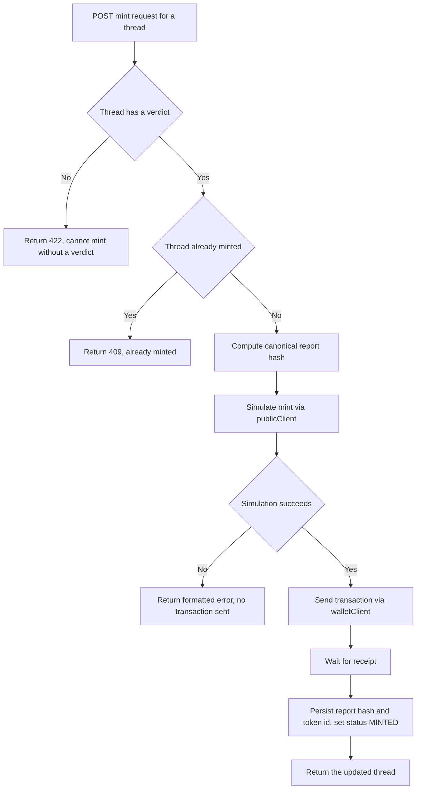

# Council Chain Integration — Report Minting

| | |
|---|---|
| **Version** | 1.1 |
| **Status** | Implemented |
| **Date Created** | 2026-09-24 |
| **Last Updated** | 2026-09-24 |

| Version | Date | Change |
|---|---|---|
| 1.1 | 2026-09-24 | Implementation complete, live-verified end to end against a local Anvil fork of BSC Testnet (mocked debate for speed, real on-chain mint transaction). All fast tests pass (`report-hash.test.ts` — 5 tests, corrected mid-build: the initial test design reversed array order to check "reordering changes the hash," but the canonical serializer deliberately re-sorts by `sequence`/`ordinal` regardless of array position, so reversing order produced no change and the test was asserting the wrong property; rewrote to swap which *content* owns which sequence/ordinal number instead — that's what should and does change the hash; `threads-mint.test.ts` — 3 guard tests). **Real bug found and fixed via the live run**: `mintReport` picked the tokenId from whichever log came first at the registry's address, but a mint emits both the ERC-721 `Transfer` event *and* our `ReportMinted` event, and `Transfer` fires first — `topics[1]` on `Transfer` is `from` (the zero address), not a token id, so every mint silently recorded `tokenId: "0"`. Fixed with `parseEventLogs({ eventName: "ReportMinted" })` to decode the correct event by name rather than positional guessing. Verified against real on-chain state (`ownerOf` returns the correct address for the real minted token id) both before and after the fix. Also fixed: `setThreadMintResult` updated `report_hash`/`token_id` but never flipped `status` to `MINTED` — Definition of Done #3 required both. |
| 1.0 | 2026-09-24 | Initial draft |

> **Summary.** Give the backend a real viem client that can read the canonical Identity Registry and mint a report on `CouncilReportRegistry`. Compute the canonical report hash from a finished thread's persisted state, expose `POST /threads/:publicRef/mint`, and simulate every write before sending it. Developed and tested against a local Anvil fork of BSC Testnet — real BSC Testnet deployment is a separate, later step requiring the user's explicit go-ahead and a funded key.

---

## 1. Problem Statement

`CouncilReportRegistry` exists, is tested, and was proven end-to-end via `cast` against a local fork — but nothing in the backend can call it yet. A finished, verdict-bearing thread has no way to become an on-chain attestation.

---

## 2. Definition of Done

| # | Criterion |
|---|---|
| 1 | A pure function computes a canonical report hash from a thread's persisted idea, research, posts (in order), and verdict — the same thread always hashes identically; reordering references or posts changes the hash. |
| 2 | `POST /threads/:publicRef/mint` simulates the mint call before sending it, and only sends if the simulation succeeds. |
| 3 | On success, the thread's `report_hash` and `token_id` are persisted and its status becomes `MINTED`. |
| 4 | Minting a thread that has no verdict yet is rejected with a clear error, not a revert surfaced as a raw RPC error. |
| 5 | Minting an already-minted thread is rejected before ever touching the chain (not relying on the contract's revert alone). |
| 6 | Fast tests cover the hash function and the mint endpoint's guard logic without touching a real chain. |
| 7 | One real broadcast against the local Anvil fork proves the whole path: compute hash → simulate → send → persist → status flips to `MINTED`. |

---

## 3. Business Rules

- The report hash is computed over a fixed field order (documented in code, not left implicit): `idea`, `research`, each post in `sequence` order (`agentKey`, `round`, `body`, each reference's `label`+`url` in `ordinal` order, `quoteOfAgentKey`, `quoteText`), then the verdict (`statusText`, `score`, each risk in `ordinal` order, `conclusion`, `unprovenGap`). Never includes a timestamp, a database id, or anything that isn't part of the debate's actual content — otherwise the same debate would hash differently between two people who mint it.
- Minting requires a verdict to exist. No verdict, no mint — checked before any chain call.
- The backend's own configured minter key is the only account that can ever successfully call `mint` (the contract enforces this too, via `onlyOwner`, but the backend should not rely on a contract revert to communicate this to a user — there is only one minter, ours, so this should never actually be reachable from the API).

---

## 4. Approach / Solution Overview

`viem`'s `createPublicClient`/`createWalletClient` against `env.chain.rpcUrl`. Every write path: `publicClient.simulateContract(...)` first (per this repo's own `AGENTS.md` §5 rule), then `walletClient.writeContract(request)` only if simulation succeeds, then wait for the receipt before persisting.

| Option | Pros | Cons |
|---|---|---|
| **viem simulate-then-write, minter key held server-side** (chosen) | Matches `AGENTS.md` §5 exactly; the user never signs — the backend is the sole minter, matching the contract's `onlyOwner` design | The minter key is a real secret the backend must hold; scoped narrowly here (this workplan doesn't address key custody hardening — flagged in §11) |

The report hash function lives in `service/chain/report-hash.ts`, pure and synchronous, taking a fully-loaded `Thread` (with posts, references, verdict, risks already eager-loaded) and returning a `0x`-prefixed `bytes32` hex string via `viem`'s `keccak256`.

---

## 5. Database / Data Design

No schema changes — `threads.report_hash` and `threads.token_id` already exist from `001_initial_schema.sql`, unused until now.

---

## 6. Flow Diagram

---

## 7. Event Summary Table

| Event | On-chain | Persisted |
|---|---|---|
| Mint requested, no verdict yet | none | none, 422 returned |
| Mint requested, already minted | none | none, 409 returned |
| Simulation fails | none | none, formatted error returned |
| Simulation succeeds, transaction sent | one `ReportMinted` event | `threads.report_hash`, `threads.token_id`, `threads.status = MINTED` |

---

## 8. Scenario Walkthrough

**Happy path.** A thread finishes with a verdict. The author calls mint; the backend hashes the thread, simulates, sends, and the thread flips to `MINTED` with a real token id.

**Edge case — mint called twice.** Second call sees `threads.status = MINTED` already and returns 409 without ever calling the chain, even though the contract itself would also reject a duplicate `reportHash`.

**Error case — simulation reverts for an unexpected reason.** The raw viem/RPC error is caught and reformatted into a plain message; the API never leaks a raw RPC error string to the client.

---

## 9. Impacted Files / Components

| Layer | File | Action |
|---|---|---|
| Service | `backend/src/service/chain/client.ts` | NEW — public + wallet client factories, reading `env.chain.*` |
| Service | `backend/src/service/chain/report-hash.ts` | NEW — canonical hash function |
| Service | `backend/src/service/chain/mint-report.ts` | NEW — simulate-then-write, orchestrates the flow in §6 |
| Repository | `backend/src/repository/ThreadRepository.ts` | MODIFY — already has `setThreadMintResult`, reused here |
| Controller | `backend/src/http/controllers/threads.ts` | MODIFY — add mint handler |
| Route | `backend/src/http/routes/threads.ts` | MODIFY — add `POST /:publicRef/mint` |
| Config | `backend/src/config/env.ts` | MODIFY — add `reportRegistryAddress`, `minterPrivateKey` |
| Test | `backend/test/service/chain/report-hash.test.ts` | NEW |
| Test | `backend/test/http/threads-mint.test.ts` | NEW — guard logic (no verdict, already minted), chain calls mocked |

---

## 10. Data Migration / Backfill Strategy

Not applicable.

---

## 11. Decisions Requiring Review

> [!WARNING]
> **The minter private key lives in a plain env var for this workplan.** Acceptable for a hackathon build; a real deployment needs a proper secret store or a narrowly-scoped signer service. Not addressed here — flagged so it isn't mistaken for a considered decision.

> [!IMPORTANT]
> **This workplan targets a local Anvil fork, never real BSC Testnet, until the user explicitly approves a real deployment.** `council-smart-contract.md` §11 (v1.2) already established the real-deployment path (fresh non-public key, user's go-ahead required) — this workplan's own verification stays local.

---

## 12. Open Questions

| # | Question | Blocks |
|---|---|---|
| 1 | Should the metadata `uri` passed to `mint` point at something real (hosted JSON) or stay a placeholder until a hosting story exists? | Not blocking — placeholder is fine for now, revisit once real deployment is planned |

---

## 13. Verification Plan

### Automated tests

| Test | Assertion |
|---|---|
| report-hash | Same thread data hashes identically across two calls |
| report-hash | Reordering references or posts changes the hash |
| HTTP mint | A thread with no verdict returns 422, no chain call attempted |
| HTTP mint | An already-`MINTED` thread returns 409, no chain call attempted |

### Manual verification

1. Deploy `CouncilReportRegistry` and register the 5 agents against a local Anvil fork of BSC Testnet.
2. Run a real (or mocked, for speed) debate to a finished verdict.
3. Call the mint endpoint; confirm a real transaction lands on the local fork, the thread's `report_hash`/`token_id` persist, and status becomes `MINTED`.
4. Call mint again on the same thread; confirm it's rejected without a second on-chain transaction.
