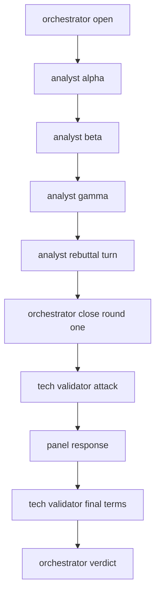
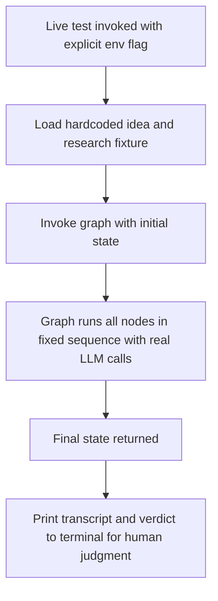

# Council Debate Engine

| | |
|---|---|
| **Version** | 1.2 |
| **Status** | Implemented |
| **Date Created** | 2026-09-23 |
| **Last Updated** | 2026-09-23 |

| Version | Date | Change |
|---|---|---|
| 1.2 | 2026-09-23 | Implementation complete, all 9 Definition of Done criteria verified. §11 records two findings from the build: DeepSeek's V4 models default to "thinking" mode, which rejects the forced `tool_choice` used by structured output — requires `modelKwargs: { thinking: { type: "disabled" } }` on every call. §12 Q2 answered: the Tech Validator reads the Orchestrator's `roundOnePosition` statement, not the full Round 1 transcript. Live run against the launchpad-vesting fixture cost ≈$0.01 for the full 13-call debate (vs. the ≈$0.006 estimate in `council-mvp.md` §4.4 — same order of magnitude). Live-transcript judgment (Definition of Done #8): the panel genuinely disagreed, quoted and dismantled each other's exact sentences, and reversed a position when shown a better argument (Market Analyst β withdrew a specific unsourced figure after direct attack) — judged as real adversarial debate, not decorative agreement. |
| 1.1 | 2026-09-23 | Dropped the separate `scripts/run-debate.ts` CLI runner — a script that invokes the graph and prints a transcript for human judgment is a test, not an operational script. Folded it into `test/service/agent/council-graph.live.test.ts`, gated behind an explicit env flag since it makes real, paid LLM calls. Split the structural graph test (§9, §13) into a fast/mocked test and this live/paid one, so the free test suite never accidentally incurs cost. |
| 1.0 | 2026-09-23 | Initial draft |

> **Summary.** Build the five-agent debate as a standalone LangGraph graph, exercised by a live test against a hardcoded idea — no database, no API, no UI. The one thing this must prove is whether cheap models actually argue with each other, not whether the rest of the system works. Everything here is scoped to that single question.

---

## 1. Problem Statement

The debate engine is the only part of The Council whose outcome is genuinely unknown. Schema, UI, and contracts are execution — we know how to build them, they just take time. Whether `deepseek-flash` agents given conflicting mandates produce real disagreement — citing evidence, quoting each other's exact words, changing position when shown a better argument — or collapse into agreeable filler is not something research or reasoning can answer. It can only be observed by running it.

If it collapses, the whole product is a chatbot wearing five name tags, and that has to be known now, on Day 1 of 7, while there is still time to change the model routing or the prompts — not on Day 5 after the database and UI are already wrapped around it.

---

## 2. Definition of Done

| # | Criterion |
|---|---|
| 1 | A live test runs the full two-round debate against one hardcoded idea, printing the transcript to the terminal for a human to read. |
| 2 | Round 1 produces three analyst posts plus at least one direct rebuttal that quotes another analyst's exact sentence. |
| 3 | The Orchestrator closes Round 1 with a single position statement. |
| 4 | Round 2 produces a Tech Validator attack on that position, one panel response, and the validator's final terms. |
| 5 | The Orchestrator closes with a verdict: status line, score 0–100, risk list, conclusion, unproven gap. |
| 6 | Every substantive post carries at least one reference. |
| 7 | The prompt for every call is composed in the fixed order from plan §4.5 of `council-mvp.md`, verified by a test, not just by inspection. |
| 8 | Run the same idea through the graph twice; read both transcripts side by side and judge honestly whether the disagreement is real or decorative. |

Done means a human reads the transcript and believes the panel actually tried to beat each other, not that the code runs without throwing.

---

## 3. Business Rules

- Fixed two rounds, no convergence loop, no turn caps — per `council-mvp.md` §4.3.
- Model routing: Orchestrator on `deepseek-v4-pro`, the three analysts and the Tech Validator on `deepseek-flash` — per `council-mvp.md` §4.4.
- Agent debate language is always English — per `AGENTS.md` §4.3.
- Prompt composition order is fixed: system prompt → submitted idea → submitted research → thread so far → agent role instruction. Never reordered, never re-serialized mid-thread — per `council-mvp.md` §4.5.
- Every substantive claim carries a citation; the council is harder on submissions with no supporting research.

---

## 4. Approach / Solution Overview

A single `StateGraph` from `@langchain/langgraph`, with one node per agent turn plus two orchestrator nodes (round-1 close, round-2 close/verdict). Nodes are pure functions over a shared state object; there is no external side effect — no database write, no HTTP call — anywhere in this graph. That is what makes it testable standalone and cheap to iterate on.

| Option | Pros | Cons |
|---|---|---|
| **LangGraph `StateGraph`, fixed node sequence** (chosen) | Matches the two-round fixed flow exactly; each turn is inspectable state; trivial to unit test node-by-node | LangGraph is new to this codebase, some setup cost |
| Plain sequential async function, no graph library | Fewer moving parts, faster to write | Throws away LangGraph's checkpointing and node composition for zero benefit here, and diverges from `AGENTS.md` §7.1 which already commits to LangGraph |
| Dynamic graph with conditional edges for convergence | Closer to the "real" product | Explicitly cut in `council-mvp.md` §4.3 for the 7-day deadline — not revisited here |

### Graph shape



`analyst rebuttal turn` (node E) is where each analyst is given the other two analysts' posts and instructed to rebut one directly, quoting its exact sentence — this is the node most likely to produce filler instead of a real attack, and the one to inspect hardest in Definition of Done #8.

### State shape

```typescript
type DebateState = {
  idea: string;
  research: string;
  posts: Array<{
    agentKey: "orc" | "m1" | "m2" | "m3" | "tech";
    round: 1 | 2;
    body: string;
    references: Array<{ label: string; url?: string }>;
    quoteOf?: { agentKey: string; text: string };
  }>;
  roundOnePosition?: string;
  verdict?: {
    statusText: string;
    score: number;
    risks: Array<{ label: string; severity: "low" | "medium" | "high"; note?: string }>;
    conclusion: string;
    unprovenGap: string;
  };
};
```

---

## 5. Database / Data Design

None. This feature does not touch the database. `Thread`, `ThreadPost`, and related Sequelize models built in the infra pass exist already but are not called from this graph — persistence is the next workplan, `council-persistence-api.md`, built once this one is done and judged good.

---

## 6. Flow Diagram

### Write path

There is no write path — the graph's only output is an in-memory `DebateState`, printed to stdout by the live test.

### Read path



---

## 7. Event Summary Table

| Node | Reads from state | Writes to state | Model |
|---|---|---|---|
| orchestrator open | `idea`, `research` | one `orc` post | `deepseek-v4-pro` |
| analyst alpha/beta/gamma | `idea`, `research`, prior posts | one post each | `deepseek-flash` |
| analyst rebuttal turn | all Round 1 posts so far | one rebuttal post per analyst, with `quoteOf` | `deepseek-flash` |
| orchestrator close round one | all Round 1 posts | `roundOnePosition`, one `orc` post | `deepseek-v4-pro` |
| tech validator attack | `roundOnePosition` | one `tech` post | `deepseek-flash` |
| panel response | tech validator's attack | one post from the panel | `deepseek-flash` |
| tech validator final terms | panel response | one `tech` post | `deepseek-flash` |
| orchestrator verdict | full `posts` history | `verdict` | `deepseek-v4-pro` |

---

## 8. Scenario Walkthrough

**Happy path.** Idea: "A launchpad for small BSC teams, 0.5% fee paid in BNB, investor vesting enforced on-chain." Research: three bullet points on launch volume and vesting audit cost, mirroring the design's own thread #4192. Expect: α argues real demand from launch volume, β rebuts with the free-template counter-argument quoting α's exact sentence, γ resolves toward a raise-based fee, the Orchestrator closes Round 1 with that position, the Tech Validator attacks the custody risk, the panel responds, and the verdict lands around "Conditional Pass" with the demand-unproven gap named.

**Edge case — no research provided.** Idea submitted with an empty `research` string. Expect the analysts to call out the missing evidence explicitly in their posts, and the verdict's `unprovenGap` to name it.

**Error case — a node returns unparseable output.** The LLM returns prose that doesn't fit the expected post shape (missing citation, no quote where one was required). The node throws rather than silently accepting malformed state; the live test surfaces the raw error rather than continuing with a broken transcript.

---

## 9. Impacted Files / Components

| Layer | File | Action |
|---|---|---|
| Service | `backend/src/service/agent/council-graph.ts` | NEW — builds and compiles the `StateGraph` |
| Service | `backend/src/service/agent/state.ts` | NEW — `DebateState` type |
| Service | `backend/src/service/agent/nodes/orchestrator.ts` | NEW — open, close-round-one, verdict |
| Service | `backend/src/service/agent/nodes/analyst.ts` | NEW — single analyst turn, parameterised by mandate |
| Service | `backend/src/service/agent/nodes/rebuttal.ts` | NEW — the cross-analyst rebuttal turn |
| Service | `backend/src/service/agent/nodes/tech-validator.ts` | NEW — attack and final-terms turns |
| Service | `backend/src/service/agent/prompts/agents.ts` | NEW — the five mandate definitions from `AGENTS.md` §6 |
| Service | `backend/src/service/agent/prompts/compose.ts` | NEW — enforces the fixed prompt order from §4.5 |
| Service | `backend/src/service/agent/llm.ts` | NEW — model client factory, reads `env.llm.*` |
| Test | `backend/test/fixtures/idea-launchpad-vesting.ts` | NEW — the hardcoded idea and research fixture, shared by both test files below |
| Test | `backend/test/service/agent/compose.test.ts` | NEW — asserts prompt order and prefix stability, no LLM calls |
| Test | `backend/test/service/agent/council-graph.test.ts` | NEW — fast, mocked LLM responses; asserts graph shape: round 2 never precedes round 1's position, every substantive post has a reference |
| Test | `backend/test/service/agent/council-graph.live.test.ts` | NEW — real LLM calls, `test.skipIf(process.env.RUN_LIVE_DEBATE !== "true")`, prints the full transcript for human judgment against Definition of Done #8 |

---

## 10. Data Migration / Backfill Strategy

Not applicable — no persisted data.

---

## 11. Decisions Requiring Review

> [!IMPORTANT]
> **"Good enough to proceed" is a human judgement call, not a metric — and it has now been made once, not repeatedly.** One live run against the launchpad-vesting fixture (2026-09-23) was read in full and judged as real adversarial debate: Market Analyst β was quoted attacking a specific unsourced figure and withdrew it explicitly in the next turn; the Tech Validator named concrete architectural failures (custody, upgrade path, oracle coupling) rather than generic caution; the panel's response engaged with and partially conceded those findings. This judgement has only been exercised on one transcript, not the two the verification plan calls for — see §13 for what remains unverified.

> [!WARNING]
> **Peak-hour DeepSeek pricing doubles mid-run if this is iterated on during 01:00–04:00 or 06:00–10:00 UTC.** Not a blocker, just worth knowing before running this repeatedly for prompt tuning.

> [!WARNING]
> **DeepSeek's structured-output pipeline hangs rather than errors under a naive timeout when chained across many sequential calls.** The rebuttal node alone makes 3 sequential LLM calls inside what looks like one graph node, so the real sequential call count for a full debate is 13, not the 11 boxes in the §4 diagram. A 120-second test timeout was too short and looked like a hang; 300 seconds was sufficient (actual: ~150 seconds). Size any future timeout off actual sequential call count, not node count.

---

## 12. Open Questions

| # | Question | Answer |
|---|---|---|
| 1 | If the panel does collapse into agreeable filler, is the fix stronger adversarial instructions, a stronger model for the analysts too, or a structural change? | **Did not happen** on the one live run completed — `deepseek-flash` for all four non-Orchestrator agents produced genuine disagreement, exact-quote rebuttals, and a position reversal. Not re-tested a second time; could still be idea-dependent. |
| 2 | Does the Tech Validator need the full Round 1 transcript, or only the Orchestrator's closing position statement? | **Answered in the implementation:** only `roundOnePosition`, per `nodes/tech-validator.ts`. This kept the Round 2 prompts shorter without visibly hurting attack quality in the one run observed. |

---

## 13. Verification Plan

### Automated tests

Fast tests run with every `bun test` and make no LLM calls — node functions are exercised with stubbed model responses.

| Test | Assertion |
|---|---|
| Prompt composition order | Composed prompt string places the role instruction after the thread-so-far segment, for every agent |
| Prompt prefix stability | Calling compose twice with the same state up to turn N produces byte-identical output for the shared prefix |
| Graph sequencing | Round 2 nodes never execute before `roundOnePosition` is set |
| Citation presence | Every post except the Orchestrator's opening carries at least one reference |
| Verdict shape | `verdict.score` is an integer 0–100; `unprovenGap` is non-empty |

The live test makes real, paid LLM calls and never runs unless explicitly invoked — it is the human-judgment gate, not a CI check.

| Test | What it does |
|---|---|
| `council-graph.live.test.ts` | Skipped unless `RUN_LIVE_DEBATE=true`; runs the real graph against the fixture idea and prints the full transcript to the terminal |

### Manual verification

| # | Step | Status |
|---|---|---|
| 1 | Run `RUN_LIVE_DEBATE=true bun test test/service/agent/council-graph.live.test.ts` against the fixture idea and research | **Done**, 2026-09-23 |
| 2 | Read the full transcript top to bottom. Confirm rebuttals quote exact sentences, positions change under attack, and the Tech Validator names concrete technical risk rather than generic caution | **Done** — all three held; see §11 |
| 3 | Run it a second time with the same input. Confirm the two transcripts differ in wording but land on structurally similar positions | **Not done** — the agreed 5-live-call budget for this workplan was spent reaching one successful full run (3 calls went to diagnosing a timeout that turned out to be test configuration, not a code defect). Needs new budget to complete. |
| 4 | Run once with `research` overridden to an empty string. Confirm the panel calls out the missing evidence | **Not done**, same budget constraint |
| 5 | Time the full run and note wall-clock duration | **Done** — ≈150 seconds for the full 13-call sequence, off-peak |
