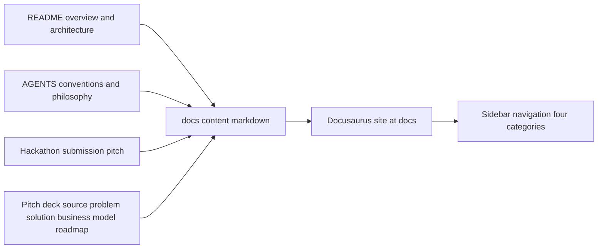

# Council Docs Site

| | |
|---|---|
| **Version** | 1.6 |
| **Status** | Implemented |
| **Date Created** | 2026-09-27 |
| **Last Updated** | 2026-09-30 |

| Version | Date | Change |
|---|---|---|
| 1.6 | 2026-09-30 | Implemented the v1.5 extension in the repo: `docs/vercel.json` (docusaurus-2 framework, `bun run build`, `build` output, `ignoreCommand` that builds only `main`), `url` in `docusaurus.config.ts`, and the root `README.md` updates. Verified locally: `vercel.json` parses; the `ignoreCommand` exits 1 for `main` (build) and 0 for another branch (skip); `bun run build` still succeeds. `the-council-dapp-docs.vercel.app` currently answers `DEPLOYMENT_NOT_FOUND`, so the name appears unclaimed. Not done: creating the Vercel project, setting Root Directory to `docs`, and the first deploy. Those three Manual verification steps, plus the README link resolving, stay open until that project exists. |
| 1.5 | 2026-09-30 | Scope extended at the user's request. Definition of Done: "hosting/deploy setup" moves from out of scope to in scope, limited to a `docs/vercel.json` that builds only the `main` branch for the Vercel project served at `the-council-dapp-docs.vercel.app`, plus `url` in `docusaurus.config.ts` set to that domain, plus a root `README.md` update linking the docs site. CI workflows stay out of scope. Impacted Files: added `docs/vercel.json`, moved `README.md` from `[REFERENCE]` to `[MODIFY]`, noted the `docusaurus.config.ts` change. Verification Plan: added deploy-config checks. Status returned to Approved until this extension is implemented. |
| 1.4 | 2026-09-30 | Implemented. Verification Plan results: `bun run typecheck` clean; `bun run build` succeeds with `onBrokenLinks` and `onBrokenMarkdownLinks` set to `throw`, emitting the homepage and all ten content pages; `git status` shows `docs/plans/*.md` and `docs/hackathon-submission.md` unmodified. One finding: `@docusaurus/theme-mermaid` requires `@mermaid-js/layout-elk` at build time, which the plan did not list — added to `docs/package.json`. Not yet verified, because no browser was available: mermaid diagrams actually rendering, dark/light legibility, mobile sidebar drawer and stacked CTAs, and the "planned" labels reading clearly — those four Manual verification steps are still open. Also added `docs/bun.lock` (per the repo's bun-lockfile convention) and two logo SVGs under `docs/static/img/`. |
| 1.3 | 2026-09-30 | Feature Description, "Design system — hybrid mapping": added a "Resolved at implementation time" list covering five decisions the plan left open or contradicted itself on — dark-mode tokens (the frontend has a light design only), hero CTA color (Feature Description said ink-primary, UI/UX said gold), logo asset (the frontend SVG has a filled background rect), footer style, and code-block theme. No change to scope. |
| 1.2 | 2026-09-30 | Header: Status changed from Draft to Approved after the user green-lit implementation. No change to scope or content. |
| 1.1 | 2026-09-27 | Added a fourth sidebar category, "Product" (Problem & Solution, Business Model, Roadmap, Moat), seeded from a previously-undocumented pitch deck now saved verbatim at `docs/pitch-deck-source.md`. Updated Definition of Done, Feature Description's content architecture table, and Impacted Files accordingly. |
| 1.0 | 2026-09-27 | Initial draft |

---

## Problem Statement

The Council has no browsable documentation site. Project context is scattered across `README.md` (architecture, quick start), `AGENTS.md` (conventions, agent philosophy, system design), and `docs/hackathon-submission.md` (product pitch) — all plain files a reader has to find and open individually. There is no single navigable entry point a judge, contributor, or new agent-role author can land on to understand the product and system without already knowing which file to open.

`docs/plans/*.md` already exists as a work-planning trail under `docs/` (per `AGENTS.md` §1.4) and must not be disturbed by this change.

Beyond mechanics and architecture, the product also has a problem statement, a business model, a competitive moat, and a quarterly roadmap — but that material only existed as a pitch deck outline shared in conversation, not as a file in the repo. It is now saved verbatim at `docs/pitch-deck-source.md` and feeds the "Product" content category below.

## Definition of Done

- A Docusaurus 3.7 site is scaffolded directly at `docs/` (not a new sibling folder), buildable with `bun run build` from inside `docs/`.
- `docs/plans/*.md` and `docs/hackathon-submission.md` remain exactly where they are, untouched, and are not pulled into the published site navigation.
- The site has a seeded set of content pages (not empty placeholders) drafted from `README.md`, `AGENTS.md`, `docs/hackathon-submission.md`, and `docs/pitch-deck-source.md`.
- Roadmap targets and the additional pricing tiers (Slides 7–8) are surfaced as explicitly "planned, subject to change" — not stated as committed fact.
- Slide 9's closing quote and tagline appear on the Overview page; its unfilled fundraising "Ask" and contact placeholders are dropped, not shown on the public site.
- Visual design follows the hybrid direction: Mintlify-style structural patterns (hero band, 3-column docs layout, pill buttons, card grids) rendered using The Council's own existing tokens (`frontend/app/globals.css`) — no new brand identity is introduced.
- `bun run build` completes with zero broken links (`onBrokenLinks: 'throw'`).
- `docs/vercel.json` makes Vercel build only the `main` branch; every other branch skips its build. The site's `url` is `https://the-council-dapp-docs.vercel.app`.
- The root `README.md` links to the docs site and documents how to run and verify it.

**Explicitly out of scope for this plan:**
- CI workflows (GitHub Actions) for the docs site. Hosting is handled by Vercel's own Git integration, configured only through `docs/vercel.json`.
- Publishing `docs/plans/*.md` content into the site (those stay internal work-plans).
- Any change to `frontend/`, `backend/`, or `smart-contract/`.

## Feature Description

### Site location & tooling

The Docusaurus package lives at the repo's existing `docs/` folder, as a self-contained package (own `package.json`, own `bun.lock`) — matching how `frontend/` and `backend/` are already structured as independent folder-packages, not a workspace. Bun is the package manager, per `AGENTS.md` §3 (`bun install`, `bun run start`, `bun run build`).

To avoid the folder-name collision that would come from Docusaurus's default `docs/docs/` content path, the classic preset's `docs.path` is set to `content`, so markdown lives at `docs/content/*.md` — sibling to (and independent from) `docs/plans/` and `docs/hackathon-submission.md`.

```
docs/
├── package.json
├── tsconfig.json
├── docusaurus.config.ts
├── sidebars.ts
├── content/           ← new site content (this plan)
├── src/                ← new site theme/components (this plan)
├── static/             ← new site assets (this plan)
├── plans/              ← existing, untouched
└── hackathon-submission.md   ← existing, untouched
```

`@docusaurus/theme-mermaid` is enabled so the mermaid diagrams already in `README.md` and `AGENTS.md` can be reused directly in doc pages.

### Content architecture

Sidebar has four categories, seeded from existing sources (rewritten for a public reader, not copied verbatim from `AGENTS.md`, which is written for AI agents):

| Category | Page | Seeded from |
|---|---|---|
| Introduction | Overview | `docs/hackathon-submission.md` pitch, README overview, Slide 9 closing quote + tagline |
| Introduction | Getting Started | README quick start section |
| Product | Problem & Solution | Slides 2–5 of `docs/pitch-deck-source.md` (problem, effect of problem, solution, effect of solution) |
| Product | Moat | Slide 6 of `docs/pitch-deck-source.md`, cross-referenced with `docs/hackathon-submission.md`'s "Why it's genuinely on-chain" section |
| Product | Business Model | Slide 7 of `docs/pitch-deck-source.md` (live pay-per-debate model; additional tiers marked "planned"), `docs/hackathon-submission.md` Business Flow diagram (treasury/revenue) |
| Product | Roadmap | Slide 8 of `docs/pitch-deck-source.md` (quarterly plan, marked "planned, subject to change") |
| Concepts | Agent Roles & Philosophy | `AGENTS.md` §6 (fundamental rules, agent roles table) |
| Concepts | Debate Flow | `AGENTS.md` §6 round structure — mechanics only; business/revenue framing lives under Business Model instead |
| System Design | Architecture | README architecture + write-path diagrams, `AGENTS.md` §7 (backend/frontend/smart-contract layout) |
| System Design | Repository Conventions | `AGENTS.md` §1–5, §9, condensed for an external reader |

### Design system — hybrid mapping

Structural patterns are adopted; color and type tokens are not — they stay The Council's own, already defined in `frontend/app/globals.css`.

| Mintlify-spec pattern | The Council equivalent used instead |
|---|---|
| `{colors.brand-green}` accent | `--color-accent` (`#f3ba2f` gold) |
| `{colors.primary}` black pill | `--color-ink` (`#111111`) |
| `{colors.canvas}` | `--color-canvas` (`#ffffff`) |
| `{colors.surface}` / `{colors.surface-soft}` | `--color-surface` / `--color-surface-soft` |
| `{colors.hairline}` | `--color-hairline` / `--color-hairline-soft` |
| Ink/Charcoal/Slate/Steel text hierarchy | `--color-ink` / `--color-slate` / `--color-muted` / `--color-stone` |
| Inter (body) | Inter — already The Council's body font |
| Geist Mono (code) | JetBrains Mono — already The Council's mono font |
| Inter (headings, in Mintlify's spec) | Outfit — already The Council's display font, used here for the docs site's headings too |
| `{rounded.full}` pill buttons | Kept as-is (universal pill buttons) — introduces one site-scoped token, `--radius-full: 9999px`, alongside the existing `--radius-xs/sm/md/lg` scale. Not written back into `frontend/app/globals.css`. |
| 3-column docs layout (sidebar / prose / TOC) | Docusaurus classic theme's native layout — no custom component needed |
| Atmospheric gradient hero band | **Not adopted.** The Council's existing frontend is flat (no gradients defined anywhere in `globals.css`). The docs homepage hero uses a flat `--color-canvas` background, `--color-ink` headline, and a gold-accent pill CTA instead of a sky/teal gradient. |
| Testimonial orange, brand-tag, brand-warn/error chips | Not adopted — no testimonials or API property tables exist in this content set yet. Can be added later if an API reference section is built. |

**Resolved at implementation time:**

| Topic | Decision |
|---|---|
| Dark mode | The frontend ships a light design only, so dark tokens are docs-site-only and derived from the light ones: canvas `#0f0f10`, surface `#18181b`, hairline `#27272a`, ink `#fafafa`, muted `#a1a1aa`. `--color-accent` (`#f3ba2f`) is unchanged and becomes the primary link/active color in dark mode, where ink-on-canvas has no contrast. |
| Hero CTA | "Read the Docs" is the gold-accent pill with ink text (the Mintlify `button-accent-green` role); "View on GitHub" is the outline pill. The earlier "ink-primary" wording in the `HeroBand` bullet is superseded. |
| Logo | `frontend/public/logo.svg` has a filled `#F5F5F2` background rect, so the docs site uses its own background-free copy of the six-node mark (`logo-mark.svg`, plus a light variant for dark mode) and renders the title as text. |
| Footer | Light style with a top hairline, not Docusaurus's default dark footer. |
| Code blocks | Always dark (Prism Dracula in both color modes), matching the spec's dark `surface-code`. |

Two new site-local components carry the adopted structural patterns:

- `docs/src/components/HeroBand` — flat hero band (headline, subtitle, two pill CTAs: "Read the Docs" ink-primary, "View on GitHub" outline-secondary).
- `docs/src/components/FeatureCardGrid` — card grid linking into the three sidebar categories, styled with `--color-surface` cards on `--radius-lg` corners, matching `frontend`'s existing `--shadow-card` token.

### Fonts

Docusaurus (unlike the Next.js frontend) has no `next/font` — Outfit, Inter, and JetBrains Mono are loaded via `<link>` Google Fonts tags in `docusaurus.config.ts` `headTags`, then referenced by the same CSS variable names (`--font-display`, `--font-sans`, `--font-mono`) inside `docs/src/css/custom.css`.

## Impacted Files

| Layer | File | Status |
|---|---|---|
| Package | `docs/package.json` | `[NEW]` |
| Package | `docs/tsconfig.json` | `[NEW]` |
| Config | `docs/docusaurus.config.ts` | `[NEW]` |
| Config | `docs/sidebars.ts` | `[NEW]` |
| Config | `docs/vercel.json` | `[NEW]` — `ignoreCommand` skips any branch other than `main`; explicit framework, build command, and output directory |
| Config | `docs/docusaurus.config.ts` `url` | `[MODIFY]` — `https://the-council-dapp-docs.vercel.app` instead of `http://localhost:3000` |
| Content | `docs/content/overview.md` | `[NEW]` |
| Content | `docs/content/getting-started.md` | `[NEW]` |
| Content | `docs/content/problem-and-solution.md` | `[NEW]` |
| Content | `docs/content/moat.md` | `[NEW]` |
| Content | `docs/content/business-model.md` | `[NEW]` |
| Content | `docs/content/roadmap.md` | `[NEW]` |
| Content | `docs/content/agent-roles-and-philosophy.md` | `[NEW]` |
| Content | `docs/content/debate-flow.md` | `[NEW]` |
| Content | `docs/content/architecture.md` | `[NEW]` |
| Content | `docs/content/repository-conventions.md` | `[NEW]` |
| Theme | `docs/src/css/custom.css` | `[NEW]` |
| Theme | `docs/src/pages/index.tsx` | `[NEW]` |
| Theme | `docs/src/components/HeroBand/index.tsx` | `[NEW]` |
| Theme | `docs/src/components/FeatureCardGrid/index.tsx` | `[NEW]` |
| Assets | `docs/static/img/*` (favicon, logo placeholders) | `[NEW]` |
| Repo hygiene | `docs/.gitignore` (`node_modules`, `build`, `.docusaurus`) | `[NEW]` |
| Repo root | `README.md` | `[MODIFY]` — docs site link, repository table, quick start, verification row, hosting row |
| Source (read-only) | `AGENTS.md` | `[REFERENCE]` |
| Source (read-only) | `docs/hackathon-submission.md` | `[REFERENCE]` |
| Source | `docs/pitch-deck-source.md` | `[NEW]` (already created — see this plan's v1.1 changelog) |
| Untouched | `docs/plans/*.md` | `[UNCHANGED]` |

No changes to `frontend/`, `backend/`, `smart-contract/`, or `payment-facilitator/`.

## UI/UX Changes (Lo-Fi)

**Homepage** (`docs/src/pages/index.tsx`):
```
──────────────────────────────
        The Council
   Adversarial AI idea
   validation, on-chain
[ Read the Docs ]  [ GitHub ]
──────────────────────────────
[ Product ]  [ Concepts ]  [ System Design ]  [ Getting Started ]
   card          card          card                card
──────────────────────────────
```
Flat canvas background, ink headline (Outfit), gold-accent primary pill, outline secondary pill. No gradient, no illustration.

**Doc page** (any `docs/content/*.md` page): standard Docusaurus 3-column layout — left sidebar (category tree, `--color-surface` active-item background), center prose (Inter body, JetBrains Mono for inline code and mermaid-adjacent code blocks), right table-of-contents. Dark/light toggle in the navbar, defaulting to system preference (same behavior as the reference Docusaurus setup this pattern is drawn from).

**Responsive**: sidebar collapses to a drawer below tablet width; TOC hides below desktop width — both are Docusaurus classic-theme defaults, not custom-built.

## Flowchart



## Verification Plan

**Automated:**
- `cd docs && bun install && bun run build` completes with no errors and no broken links.
- `bun run build` output includes all six seeded content pages plus the homepage.

**Manual:**
- Load `bun run start` locally, click through all three sidebar categories, confirm every page renders (including any mermaid diagram reused from README/AGENTS).
- Toggle dark/light mode, confirm hero band and card grid remain legible in both.
- Resize to mobile width, confirm sidebar collapses to a drawer and the homepage CTAs stack.
- `git status` confirms `docs/plans/*.md` and `docs/hackathon-submission.md` show no diffs after scaffolding.
- Business Model and Roadmap pages visibly label projected figures (treasury TVL targets, additional pricing tiers) as planned/subject to change, not stated as shipped fact.
- The Overview page's closing quote/tagline appears with no fundraising "Ask" or contact placeholder text visible anywhere on the site.
- In the Vercel dashboard, the project's Root Directory is `docs` and its Production Branch is `main`. Pushing a non-`main` branch produces a skipped build, not a deployment.
- After the first `main` deploy, `https://the-council-dapp-docs.vercel.app` serves the homepage and `/docs/overview`.
- The README's docs link resolves and its quick-start command works as written.
