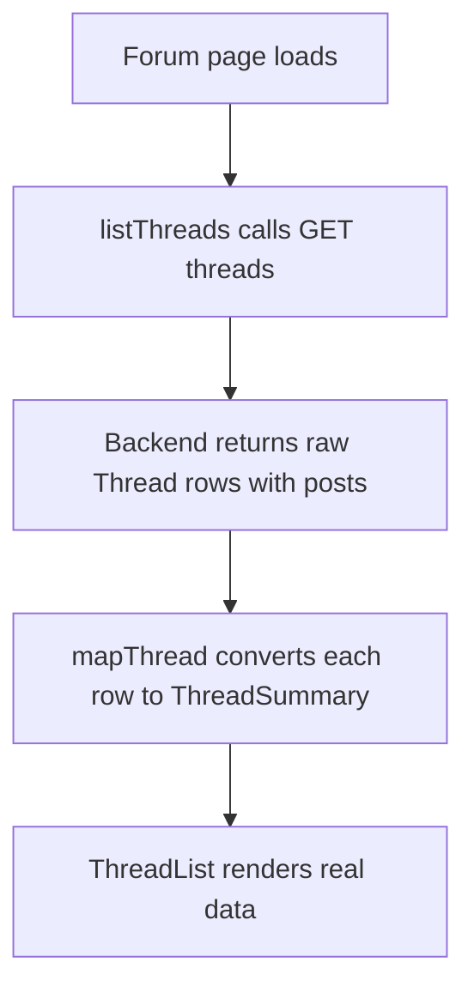

# Council Frontend — Wire to the Real Backend API

| | |
|---|---|
| **Version** | 1.1 |
| **Status** | Implemented |
| **Date Created** | 2026-09-24 |
| **Last Updated** | 2026-09-24 |

| Version | Date | Change |
|---|---|---|
| 1.1 | 2026-09-24 | Implementation complete, live-verified against the real running backend (not mocked): `bun run typecheck`/`lint`/`build` clean; `/forum` had to be marked `export const dynamic = "force-dynamic"` — the page was a Server Component fetching at build time, which fails when the backend isn't up during `next build`. `POST /threads` requires `authorAddress`, which the composer didn't collect — added `useAccount()` from wagmi and gated submission on wallet connection, since a thread needs a real author. Verified end to end: created a real thread via the backend, confirmed it rendered on the live `/forum` page. |
| 1.0 | 2026-09-24 | Initial draft |

> **Summary.** Replace `frontend/http/threads.ts`'s hardcoded stub data with real `fetch` calls against the now-working backend (`council-thread-lifecycle.md`). Home and Forum go from showing fake seed threads to showing whatever is actually in the database. New Thread composer actually creates a real thread and kicks off a real debate. Thread detail page (watching the live stream) is still out of scope — separate, later work.

---

## 1. Problem Statement

The frontend looks right but shows nothing real. The backend has worked end to end (debate, persistence, streaming, minting) since earlier today. Wiring them together is what makes the demo actually a demo.

---

## 2. Definition of Done

| # | Criterion |
|---|---|
| 1 | `listThreads()` fetches `GET /threads` and maps the backend's raw shape into the frontend's existing `ThreadSummary` type — no other file needs to change. |
| 2 | `createThread()` posts to `POST /threads` and returns the real `publicRef`. |
| 3 | The mapping handles backend fields the frontend doesn't have yet (no `excerpt` field server-side) with a sensible derivation, not a crash. |
| 4 | Typecheck, lint, and build stay clean after the change. |
| 5 | One real manual run: submit a thread through the actual composer UI, confirm it appears in the Forum list backed by the real API. |

---

## 3. Business Rules

- `ThreadSummary`'s shape (the UI's own contract) does not change — only how it gets populated changes. Components never see the backend's raw field names or casing.
- Backend status is uppercase (`LIVE`/`MINTED`/`REVISE`); frontend's is lowercase. The mapper is the one place that translates.

---

## 4. Approach / Solution Overview

Add `NEXT_PUBLIC_API_BASE_URL` env read at the top of `http/threads.ts`. Write one small `mapThread()` function. `excerpt` derives from `idea` (truncated) since the backend has no separate excerpt field — adding one is not worth a migration for a hackathon deadline.

---

## 5. Database / Data Design

None — frontend-only change.

---

## 6. Flow Diagram

---

## 7. Event Summary Table

| Event | Before | After |
|---|---|---|
| Forum page load | Shows 6 hardcoded seed threads | Shows whatever `GET /threads` actually returns |
| Submit composer | Returns a fake `thread-<timestamp>` ref, does nothing server-side | Creates a real row, starts a real debate |

---

## 8. Scenario Walkthrough

**Happy path.** Submit an idea through the composer. The Forum page, reloaded, shows it as `LIVE` with the real author address and a real reply count.

**Edge case — backend unreachable.** `fetch` throws; the UI should not hard-crash — acceptable for this pass to let the error surface in the console, hardening the empty/error state is not blocking for the demo.

---

## 9. Impacted Files / Components

| Layer | File | Action |
|---|---|---|
| Frontend | `frontend/http/threads.ts` | MODIFY — replace stub bodies with real fetch + mapping |
| Backend | `backend/src/repository/ThreadRepository.ts` | Already modified earlier today to eager-load minimal `posts` for reply counts |

---

## 10. Data Migration / Backfill Strategy

Not applicable.

---

## 11. Decisions Requiring Review

> [!IMPORTANT]
> **No excerpt field exists server-side.** Using truncated `idea` as the excerpt is a placeholder, not a considered design — fine for the demo, worth revisiting if this becomes a real product.

---

## 12. Open Questions

None blocking.

---

## 13. Verification Plan

### Automated tests

None added — this is a thin mapping layer over an already-tested backend; the frontend's own typecheck/lint/build is the safety net here.

### Manual verification

1. `bun run typecheck`, `bun run lint`, `bun run build` all clean.
2. Run the frontend dev server against the real backend; load `/forum`, confirm it shows real (or empty) data, not the old seed threads.
3. Submit a thread through the composer; confirm a new row appears via the backend's own `GET /threads`.
