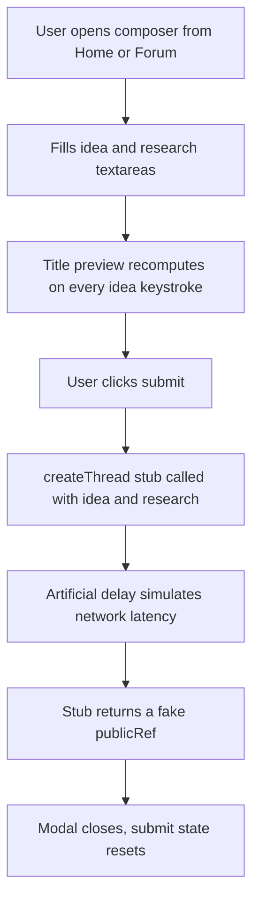
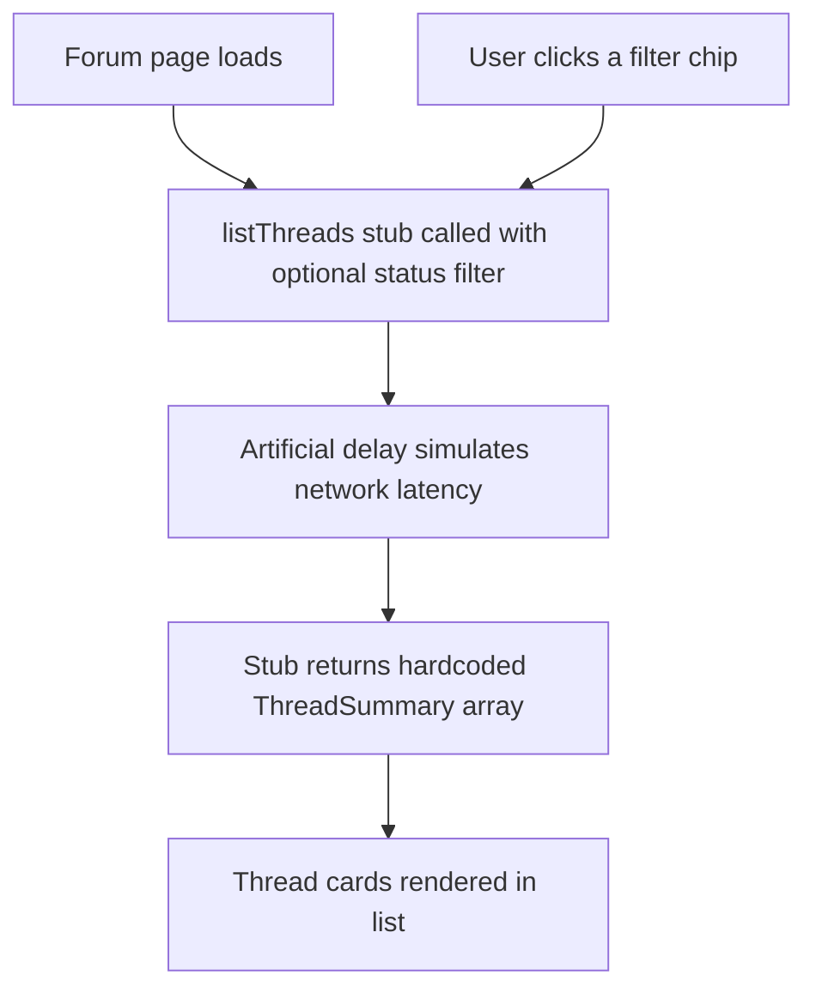

# Council Frontend — Home, Forum Index, New Thread Composer

| | |
|---|---|
| **Version** | 1.1 |
| **Status** | Implemented |
| **Date Created** | 2026-09-23 |
| **Last Updated** | 2026-09-24 |

| Version | Date | Change |
|---|---|---|
| 1.1 | 2026-09-24 | Implementation complete, verified independently (not just the builder's self-report): `bun run typecheck` clean, `bun run lint` clean, `bun run build` clean — both `/` and `/forum` compile as static pages. This closes out the plan; wiring the stub `http/threads.ts` to the real backend API is separate follow-up work, not part of this slice's scope. |
| 1.0 | 2026-09-23 | Initial draft |

> **Summary.** Build three static-data frontend surfaces — Home, the Forum index, and the New Thread composer modal — as plain React/Tailwind using the tokens already wired in `globals.css`. No real backend exists yet, so a typed stub data layer (`frontend/http/threads.ts`) stands in for it, returning hardcoded mock threads after an artificial delay. The Thread detail page (watching a live debate) is explicitly out of scope — a separate person builds it once the real streaming API exists. No on-chain writes happen anywhere in this slice.

---

## 1. Problem Statement

`frontend/app/page.tsx` is currently a placeholder scaffold page that only proves the design tokens, fonts, and wallet layer are wired — it has none of the actual product surfaces. There is no Forum index and no way to compose a new thread. Without these three surfaces, nobody can see or interact with the Council's core loop (submit an idea → browse debated threads) even in a UI-only, unwired form, which blocks parallel frontend/backend work from being demoed or reviewed before the debate-engine and persistence API land.

---

## 2. Definition of Done

| # | Criterion |
|---|---|
| 1 | `frontend/app/page.tsx` renders the full Home surface: nav, hero with tagline/subtitle/two CTAs, stats band, "how a thread runs" section, five agent cards, closing CTA. |
| 2 | `frontend/app/forum/page.tsx` renders the Forum index: header, filter chips (`All`/`Live`/`Minted`/`Revise`), and a list of thread cards sourced from the stub data layer. |
| 3 | A New Thread composer modal is reachable from both Home ("Submit an idea") and Forum ("New Thread"), with two textareas, a live title preview, a footer summary line, and a submit button wired to the stub `createThread`. |
| 4 | `frontend/http/threads.ts` exports `listThreads` and `createThread`, both typed, both clearly marked as stubs, both used by components instead of inline mock data. |
| 5 | `bun run typecheck`, `bun run lint`, and `bun run build` all pass cleanly. |
| 6 | `bun run dev` serves `/` and `/forum` without server errors, and both pages' HTML contain the expected copy strings. |
| 7 | No new hex colors or ad-hoc fonts introduced — every color/font reference resolves to an existing `@theme` token. |
| 8 | Nothing under `backend/`, `smart-contract/`, or the frozen plan docs (`council-mvp.md`, `council-debate-engine.md`) is modified. |

---

## 3. Business Rules

- Thread detail (`/forum/[id]` or similar) is explicitly not built in this slice — thread cards may link there, but the destination route does not need to exist yet (no dangling-route requirement to fix).
- No real network call to a backend exists yet — `listThreads`/`createThread` return hardcoded data after an artificial delay, and submitting the composer does not need to navigate anywhere on success beyond closing the modal (see §12 for the exact judgment call made).
- Every color and font used must come from an existing `@theme` token in `globals.css` — no new tokens are added, no inline hex values.
- All UI copy is in English, per `AGENTS.md` §4.3.
- No comments narrating what a line does, per `AGENTS.md` §4.2.
- This slice performs no on-chain writes, so `simulateContract` (`AGENTS.md` §5) does not apply here — the wallet connect button already wired in `Web3Provider` is reused as-is on the nav, nothing new is added to the wagmi layer.

---

## 4. Approach / Solution Overview

Build each surface as a Server Component page (`app/page.tsx`, `app/forum/page.tsx`) that composes smaller Client Components for anything interactive (filter chips, the composer modal, the connect button). The composer is a single modal component mounted at the layout/page level and opened via local client state, so both Home and Forum can trigger the same instance without prop-drilling a global store.

| Option | Pros | Cons |
|---|---|---|
| **Composer as a client component with local open/close state per page, duplicated trigger buttons calling the same component** (chosen) | No new global state library needed; matches the "just these three pages" scope; each page stays simple | Two pages each hold their own open/close boolean — acceptable duplication at this scale |
| Global composer state via a React Context in `contexts/` | Single source of truth if a third trigger point appears later | Introduces a context for a two-page need; premature for this slice |
| Route-based modal (`/forum/@modal/(.)new`) using Next.js parallel routes | "Proper" Next.js modal-over-route pattern, deep-linkable | Real backend/route for thread detail doesn't exist yet, so the modal has nothing meaningful to sit "over"; adds routing complexity with no present payoff |

The stub data layer (`frontend/http/threads.ts`) is the single seam between UI and backend: every component that needs thread data calls `listThreads`/`createThread` rather than importing mock arrays directly, so replacing the stub body with a real `fetch` later touches exactly one file.

---

## 5. Database / Data Design

None — no database in this slice. The stub data layer's in-memory shape is the closest thing to a schema and is documented here so the real backend can match it field-for-field:

```typescript
type ThreadStatus = "live" | "minted" | "revise";

type ThreadSummary = {
  id: string;
  title: string;
  excerpt: string;
  status: ThreadStatus;
  authorAddress: string;
  score: number | null;
  replyCount: number;
  agentKeys: AgentKey[];
};

type CreateThreadInput = {
  idea: string;
  research: string;
};

type CreateThreadResult = {
  publicRef: string;
};
```

`score` is `null` while a thread is still `live` (rendered as `··` per the wireframe). `agentKeys` is always the fixed five-agent roster (`orc`, `m1`, `m2`, `m3`, `tech`) for every seed thread, reusing the `AgentKey` shape already defined in `backend/src/service/agent/state.ts` conceptually (frontend defines its own local copy of the literal union — no cross-package import between `frontend/` and `backend/`).

---

## 6. Flow Diagram

### Write path



### Read path



---

## 7. Event Summary Table

| Interaction | Reads | Writes | Notes |
|---|---|---|---|
| Home page load | none | none | Fully static copy plus the five agent cards from `AGENT_DEFINITIONS`-equivalent local data |
| Forum page load | `listThreads()` | none | Defaults to the `All` filter |
| Filter chip click | `listThreads(status)` | none | Re-fetches from the stub with the chosen status; `All` passes no filter |
| Composer idea textarea change | none | local title-preview state only | Client-side heuristic, no network call |
| Composer submit | none | `createThread(input)` | Stub only; no real persistence yet |

---

## 8. Scenario Walkthrough

**Happy path.** A user lands on Home, reads the tagline and the five agent cards, clicks "Submit an idea." The composer opens, they type an idea ("A launchpad for small BSC teams..."), the title preview updates live to a trimmed first sentence, they add two lines of research, click submit, see a brief loading state on the button, and the modal closes.

**Edge case — filter with zero matching threads.** A user clicks the `Minted` chip and the stub happens to return zero minted seed threads. The Forum list renders the existing empty state copy from `council-mvp.md` §7 ("No threads yet — start the first one") rather than a blank list.

**Edge case — idea textarea left empty.** The user opens the composer and clicks submit without typing anything. The submit button is disabled until both textareas have non-whitespace content, so no empty-string call reaches `createThread`.

**Error case — stub rejects (not expected in normal use, but the seam must handle it).** If `createThread` ever rejects (e.g., once wired to a real API that returns a network error), the composer keeps the typed content, re-enables the submit button, and shows an inline error line rather than silently closing.

---

## 9. Impacted Files / Components

| Layer | File | Action |
|---|---|---|
| Data layer | `frontend/http/threads.ts` | NEW — `ThreadSummary`, `ThreadStatus`, `listThreads`, `createThread` stubs |
| Page | `frontend/app/page.tsx` | MODIFY — replace placeholder scaffold with the full Home surface |
| Page | `frontend/app/forum/page.tsx` | NEW — Forum index |
| Layout | `frontend/components/layout/site-nav.tsx` | NEW — shared top nav (logo, Home/Forum links, connect button) |
| Layout | `frontend/components/layout/site-footer.tsx` | NEW — shared closing CTA / footer band used on Home |
| UI | `frontend/components/ui/button.tsx` | NEW — shared button primitive (primary/secondary variants) used across Home, Forum, composer |
| UI | `frontend/components/ui/badge.tsx` | NEW — status badge (`Live`/`Minted`/`Revise`) used on thread cards |
| Forum | `frontend/components/forum/thread-card.tsx` | NEW — one thread card (id, title/excerpt, badge, author, avatar row, score, replies) |
| Forum | `frontend/components/forum/thread-list.tsx` | NEW — fetches via `listThreads`, renders filter state + cards + empty/loading states |
| Forum | `frontend/components/forum/filter-chips.tsx` | NEW — `All`/`Live`/`Minted`/`Revise` chip row |
| Agent | `frontend/components/agent/agent-avatar.tsx` | NEW — small colored circular avatar for one agent, reused in "who sits on the council" and the thread card avatar row |
| Agent | `frontend/components/agent/agent-roster.ts` | NEW — local `AgentKey`/name/mandate/color roster (frontend-local copy, no cross-package import from `backend/`) |
| Composer | `frontend/components/forum/new-thread-composer.tsx` | NEW — modal: two textareas, live title preview, footer summary, submit calling `createThread` |
| Composer | `frontend/components/forum/new-thread-trigger.tsx` | NEW — button + open/close state wrapper, mounted on both Home and Forum |

---

## 10. Data Migration / Backfill Strategy

Not applicable — no persisted data in this slice. When the real backend API lands, `frontend/http/threads.ts` is the only file that needs to change; its exported function signatures are the contract the backend should match (§5).

---

## 11. Decisions Requiring Review

> [!IMPORTANT]
> **The Thread detail route is intentionally left unbuilt, so thread-card and post-submit navigation targets are stubbed as plain `#` or a route string that does not yet resolve.** Per the task scope, someone else builds `/forum/[id]` once the real streaming API exists. Thread cards render as non-navigating for now (or link to a path that 404s under `next build` static checks only if actually visited — Next.js does not fail the build for a link `href` pointing at a route that doesn't exist, only at request time).

> [!WARNING]
> **The composer's post-submit behavior (stay open with a success message vs. close immediately) was not specified in the wireframe.** This plan chooses close-immediately (§8 happy path) as the simpler default; see §13 Open Questions.

---

## 12. Open Questions

| # | Question | Default taken in this plan |
|---|---|---|
| 1 | Should a successful composer submit navigate to the new thread, show a toast, or just close? | Close the modal only — no thread detail page exists yet to navigate to, and no toast system exists in the codebase yet. Revisit once Thread detail lands. |
| 2 | Exact wording for the "how a thread runs" step summary (3-4 steps) — the wireframe says "submit → market panel debates → tech validator attacks → verdict + mint" but doesn't give exact microcopy per step. | Plan derives concise step copy from `AGENTS.md` §6's agent-role table (§13 lists exact strings used). |
| 3 | Exact numbers for the stats band (`1,284 ideas debated`, etc.) are example placeholders from the mockup, not real data. | Reused verbatim as static copy since no real backend metric endpoint exists yet — clearly fictional placeholder data, consistent with the rest of the stub layer. |

---

## 13. UI/UX Changes (Lo-Fi)

### Home (`/`)

```
[ Logo  Home  Forum                          Connect Wallet ]

  Your idea, cross-examined.
  Post a business or project idea with the research behind it.
  A panel of market analysts argues it out among themselves, a
  technical validator stress-tests whether it can be built, and
  the whole exchange is published as a thread you can mint
  on-chain.

  [ Submit an idea ]   [ Browse the forum ]

  ---------------------------------------------------------------
  1,284           61                9,730              412
  ideas debated   median            sources cited       reports
                  consensus score   by analysts          minted on-chain
  ---------------------------------------------------------------

  How a thread runs
  1  Submit           2  Market panel debates
     Post your idea       Three analysts argue demand,
     and research          pricing, and distribution
  3  Tech validator     4  Verdict and mint
     attacks              stress-tests the buildable       Orchestrator closes with
                          architecture                     a score and you can mint

  Who sits on the council
  [Orchestrator card] [Market Analyst α card] [Market Analyst β card]
  [Market Analyst γ card] [Tech Validator card]
  (each: colored left border in agent token color, name, one-line mandate)

  Ready to have your idea cross-examined?
  [ Submit an idea ]
```

### Forum index (`/forum`)

```
[ Logo  Home  Forum                          Connect Wallet ]

  Forum
  Every idea the council has debated, live or settled.
                                                [ New Thread ]

  ( All )  ( Live )  ( Minted )  ( Revise )

  #4192  A launchpad for small BSC teams...           [Minted]
         0xAb12...9f3c   [agent avatar row x5]   Score 74   12 replies

  #4188  Perpetuals DEX with on-chain insurance pool   [Live]
         0x77Fe...02aA   [agent avatar row x5]   Score ··   6 replies

  ... (more thread cards)
```

### New Thread composer (modal, triggered from Home or Forum)

```
+-------------------------------------------------------------+
|  New Thread                                            [X]  |
|                                                               |
|  Your idea                                                   |
|  [ textarea ..................................... ]          |
|                                                               |
|  Title preview: "A launchpad for small BSC teams..."         |
|                                                               |
|  Your research                                                |
|  [ textarea ..................................... ]          |
|                                                               |
|  5 agents · full adversarial debate · 1 USDT                |
|                                    [ Submit for debate ]      |
+-------------------------------------------------------------+
```

Title preview heuristic: take the idea text's first sentence (split on `.`, `!`, `?`, or newline, whichever comes first), trim whitespace, and truncate to 68 characters with a trailing ellipsis if longer — mirrors the original mockup's `summarize()` function.

| Surface | Loading | Empty | Error |
|---|---|---|---|
| Forum | Skeleton rows while `listThreads` resolves | "No threads yet — start the first one" | Not building a retry banner in this slice — stub calls do not fail in practice; noted as a gap for when the real API lands |
| Composer | Submit button shows a spinner and disables both textareas | n/a | Inline error line under the footer, textareas keep their content, button re-enables |

---

## 14. Verification Plan

### Automated tests

No automated test suite is added for this slice — these are static/mock-data UI surfaces with no business logic worth a unit test beyond the title-preview heuristic. If time allows, one test may be added under `frontend/__tests__/` for the title-preview truncation function in isolation; not a blocker for Definition of Done.

### Manual verification

| # | Step |
|---|---|
| 1 | Run `bun run typecheck` — must exit clean |
| 2 | Run `bun run lint` — must exit clean |
| 3 | Run `bun run build` — must exit clean |
| 4 | Run `bun run dev`, `curl http://localhost:3000/`, confirm response contains "Your idea, cross-examined." |
| 5 | `curl http://localhost:3000/forum`, confirm response contains "Forum" and at least one seed thread title |
| 6 | Visually confirm five agent cards on Home use the five distinct `--color-agent-*` tokens |
| 7 | Visually confirm filter chips toggle the rendered thread list |
| 8 | Open the composer from both Home and Forum, confirm the title preview updates as the idea textarea is typed |
| 9 | Confirm submit button stays disabled until both textareas are non-empty |
| 10 | Stop the dev server after verification |

---

## Prompt History

### v1.0 — 2026-09-23
Requested the frontend implementation of Home, Forum index, and New Thread composer for The Council, following the docs-before-code sequencing, with a stub `frontend/http/threads.ts` data layer standing in for the not-yet-built backend API.
