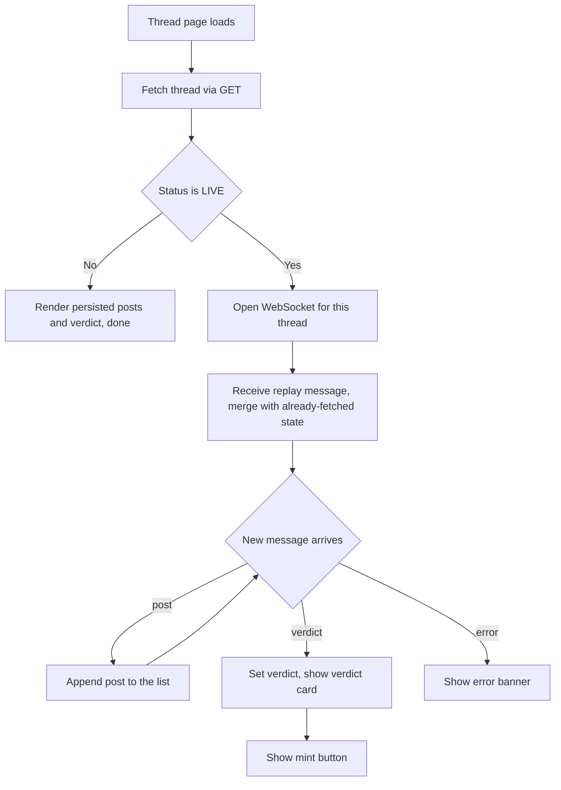

# Council Frontend — Thread View (Live Debate + Verdict)

| | |
|---|---|
| **Version** | 1.1 |
| **Status** | Implemented |
| **Date Created** | 2026-09-24 |
| **Last Updated** | 2026-09-24 |

| Version | Date | Change |
|---|---|---|
| 1.1 | 2026-09-24 | Live-verified against two real debates. Found and fixed a real gap: a debate run that errors (e.g. `GraphRecursionError`) was broadcasting a WS `error` event the frontend silently dropped, while the thread stayed `LIVE` in the database forever with no verdict — an infinite "Waiting for the next speaker…" spinner with no way for the user to ever know it died. Added a `FAILED` thread status (migration `005_add_failed_thread_status.sql`), `run-and-persist.ts` now persists it on catch, and `thread-view.tsx` now renders a real error banner instead of swallowing the message. Status → Implemented. |
| 1.0 | 2026-09-24 | Initial draft |

> **Summary.** The page nobody has built yet is the one that matters most: watching the five agents actually argue. Load a thread's persisted state, open its WebSocket, render posts as they arrive (or all at once if already finished), show round dividers, citations, quotes, and the closing verdict card. Add a mint button once a verdict exists.

---

## 1. Problem Statement

Every other surface exists. This is the one that shows the product's actual reason to exist — the debate itself — and it doesn't exist yet.

---

## 2. Definition of Done

| # | Criterion |
|---|---|
| 1 | `/forum/[publicRef]` loads a thread's already-persisted posts and verdict via `GET /threads/:publicRef`. |
| 2 | If the thread is still `LIVE`, the page opens a WebSocket and appends new posts as they arrive, live. |
| 3 | Each post shows its agent's name/colour, round, body, citations, and — if it's a rebuttal — the quoted line and who it's quoting. |
| 4 | A round divider separates Round 1 (market panel) from Round 2 (Tech Validator). |
| 5 | Once a verdict exists, a verdict card renders: status line, score, risks, conclusion, unproven gap. |
| 6 | If the thread is `LIVE` and has no verdict yet, a typing indicator shows instead of the verdict card. |
| 7 | A "Mint Research on-chain" button appears once a verdict exists and the thread isn't already `MINTED`; clicking it calls the mint endpoint. |
| 8 | Typecheck, lint, build clean. One real manual run against a live thread, start to verdict, confirms the UI updates live and matches the design 1:1. |

---

## 3. Business Rules

- Agent colour tokens and names come from the same `AGENT_ROSTER` already used on Home — no second source of truth.
- The WebSocket is only opened for `LIVE` threads; a finished thread's page just renders the persisted GET response, no socket needed.
- Mint failures show the backend's formatted error message, never a raw exception.

---

## 4. Approach / Solution Overview

Client Component (needs WebSocket + local state). Fetches initial state via `getThread(publicRef)` (new function in `http/threads.ts`), then if `status === "LIVE"`, opens `ws://.../threads/:publicRef/stream`. Incoming `post` events append to local state; a `verdict` event sets the verdict; an `error` event surfaces a banner.

| Option | Pros | Cons |
|---|---|---|
| **Client Component, fetch then WebSocket** (chosen) | Matches how the backend already structures replay-then-live | Needs `"use client"`, loses some SSR benefit for this one page |
| Server-Sent Events instead of WebSocket | Simpler client code | Backend already built a WebSocket endpoint; rebuilding the transport is wasted time under deadline |

---

## 5. Database / Data Design

None — frontend-only.

---

## 6. Flow Diagram

---

## 7. Event Summary Table

| Event | UI reaction |
|---|---|
| Initial load, thread LIVE | Persisted posts render immediately, typing indicator shows below |
| WS `post` | New post appended, typing indicator moves to "next speaker unknown" |
| WS `verdict` | Verdict card renders, typing indicator disappears, mint button appears |
| WS `error` | Error banner, no further updates expected |
| Mint button clicked | Button shows a pending state, then either the thread flips to `MINTED` or an error shows |

---

## 8. Scenario Walkthrough

**Happy path.** Open a thread mid-debate. Posts already said are there; new ones stream in one at a time; when the verdict lands, the card appears with a mint button.

**Edge case — already finished thread.** Open a `MINTED` thread directly from the Forum list. No socket opens; everything renders from the single GET response, including a "View on BscScan"-style note using the stored token id (link itself is out of scope, just show the id).

**Error case — mint fails.** Backend returns `{ error: { code, message } }`; the UI shows `message` in a banner and re-enables the button.

**Error case — debate run itself fails.** The graph throws mid-run (observed live: `GraphRecursionError` when the Tech Validator can't find an on-chain risk to attack because the submitted idea has no on-chain component at all). The thread flips to `FAILED` and stops accepting further updates; a live-connected client sees the raw error message in a red banner immediately, a client loading the page later sees a generic "This debate failed to complete." banner plus a `Failed` status badge — never an infinite spinner.

---

## 9. Impacted Files / Components

| Layer | File | Action |
|---|---|---|
| Frontend | `frontend/app/forum/[publicRef]/page.tsx` | NEW |
| Frontend | `frontend/components/thread/thread-view.tsx` | NEW — the client component driving fetch + socket |
| Frontend | `frontend/components/thread/post-card.tsx` | NEW |
| Frontend | `frontend/components/thread/round-divider.tsx` | NEW |
| Frontend | `frontend/components/thread/verdict-card.tsx` | NEW |
| Frontend | `frontend/http/threads.ts` | MODIFY — add `getThread(publicRef)` and `mintThread(publicRef)`; widen `ThreadStatus` with `failed` |
| Frontend | `frontend/components/ui/badge.tsx` | MODIFY — add `failed` label/style |
| Frontend | `frontend/components/forum/filter-chips.tsx` | MODIFY — add `Failed` filter chip |
| Backend | `backend/migrations/005_add_failed_thread_status.sql` | NEW — widen `threads_status_check` to include `FAILED` |
| Backend | `backend/src/model/Thread.ts` | MODIFY — widen `ThreadStatus` type |
| Backend | `backend/src/service/agent/run-and-persist.ts` | MODIFY — persist `FAILED` status on debate-run failure |

---

## 10. Data Migration / Backfill Strategy

Not applicable.

---

## 11. Decisions Requiring Review

> [!IMPORTANT]
> **No reconnect-on-drop logic.** If the WebSocket disconnects mid-debate, this version does not auto-reconnect — acceptable for a demo on a stable local connection, not production-grade.

---

## 12. Open Questions

- The recursion ceiling of 100 tool calls can still be exceeded for an idea the panel structurally cannot engage with (e.g. no on-chain component for the Tech Validator to attack) — the debate now fails visibly instead of hanging silently, but the underlying "how do we stop the agent from spiraling on an off-domain idea in the first place" question (raise the limit further, add domain-relevance pre-screening, or a hard per-node timeout) is not addressed here and is not blocking this plan.

---

## 13. Verification Plan

### Automated tests

None — same reasoning as the API-wiring workplan; this is thin UI over an already-tested backend, verified manually against a real run instead.

### Manual verification

1. `bun run typecheck`, `lint`, `build` clean — both frontend and backend, after every change. ✅
2. Real debate thread `74d295f4` (already finished, 11 posts, real verdict): confirmed the finished-thread render path — all 11 posts across both round dividers, 3 quote blocks, 46 reference entries, verdict card with real score/conclusion/6 risks all render correctly from the persisted `GET` response alone. ✅
3. Real debate thread `1f1f05e1` (watched live via a raw WebSocket client against the exact same endpoint the frontend uses): confirmed `replay` on connect, confirmed live `post` events arrive in the exact shape `toPost()` consumes, confirmed the typing indicator shows correctly with zero posts. ✅
4. Mint flow: fired the same `POST /threads/:publicRef/mint` the button fires against `74d295f4`; confirmed thread flipped to `MINTED` with a real `tokenId` and `reportHash`, then confirmed the page re-render shows "Minted on-chain · token #1" and the mint button is gone. ✅
5. Failure path (found live, not hypothesized): submitted an off-domain idea (no on-chain component) twice — reproduced `GraphRecursionError` both times. First run exposed the frontend/backend gap described in the v1.1 changelog; second run, after the fix, confirmed the thread persists as `FAILED` with `closedAt` set, and the page (`457d4809`) renders the `Failed` badge, a real error banner, no infinite spinner, and no orphaned mint button. ✅

No browser automation tool was available in this environment, so client-side React re-rendering from live WebSocket events was verified at the data-contract level (a raw WS client observing the exact message stream the frontend consumes, confirmed to match `toPost()`/`StreamMessage` shapes exactly) plus static SSR-output inspection of every state (live/finished/minted/failed), rather than by literally watching a browser repaint. This is disclosed rather than claimed as a full browser-driven test.
