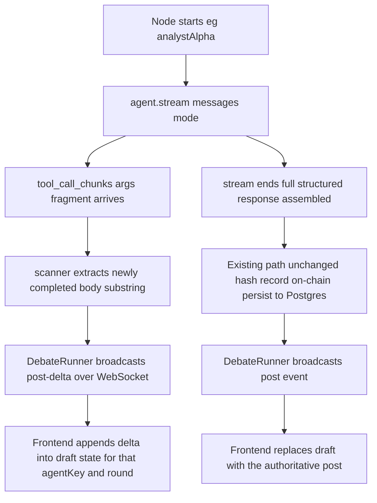

# Live Post Streaming (Token Deltas)

| | |
|---|---|
| **Version** | 1.0 |
| **Status** | Draft |
| **Date Created** | 2026-09-25 |
| **Last Updated** | 2026-09-25 |

> **Summary.** Right now a debate thread shows nothing but a static "drafting a response" dots animation for the entire time each agent is generating (often 20–40s), then the full post appears at once. This streams the model's actual token output live over the same WebSocket, so the post visibly types itself in as it's generated. Thinking/reasoning traces are explicitly out of scope — confirmed with the user: DeepSeek's forced `tool_choice` (required for every agent's structured JSON output) rejects "thinking" mode, and re-architecting that would touch all 5 agents under today's deadline. This only changes how the *existing* structured output is delivered, not how it's produced.

---

## 1. Problem Statement

`council-graph.ts`'s `invokeAgent` calls `agent.invoke(...)` — a single atomic call that only resolves once the whole structured JSON response (including the `body` prose field) is fully generated. Nothing is visible client-side until that's done. This is what's producing the "Kok lama?" experience — the debate isn't actually stuck, there's just no signal of progress during a turn.

---

## 2. Business Rules

- The streamed text is a **progress indicator only** — the authoritative `body` that gets hashed (`keccak256`), recorded on-chain (`recordPost`), and persisted to Postgres is still the final, fully-parsed structured response, exactly as today. Streaming must never change what's stored.
- No change to prompts, tools, or the forced-`tool_choice` structured-output contract for any of the 5 agents — this only changes how `council-graph.ts` invokes the already-existing agents (`.stream()` instead of `.invoke()`).
- A partial/glitchy character during streaming (e.g. a mid-escape-sequence artifact) is an acceptable, self-correcting failure mode — the final `post` event always replaces the draft outright.

---

## 3. Approach / Solution Overview

DeepSeek's API (OpenAI-compatible) streams tool-call arguments incrementally as `delta.tool_calls[0].function.arguments` string fragments even when `tool_choice` is forced to a single function — this is standard OpenAI-shape streaming behavior, not DeepSeek-specific. `createAgent`'s `.stream({...}, {streamMode: "messages"})` surfaces this as `AIMessageChunk.tool_call_chunks[].args` fragments.

| Option | Pros | Cons |
|---|---|---|
| **Scan the incrementally-growing JSON args for the `"body":"..."` string value, stream out newly-completed characters** (chosen) | One LLM call per agent turn (same as today, no added latency/cost); no changes to any agent's prompt/tools/structured-output contract | Small custom incremental-JSON-string scanner needed; must tolerate escape sequences (`\"`, `\\`, `\n`, unicode) |
| Two-pass: free-form streamed prose call, then a second small structured-extraction call for references/confidence/quote | Simpler scanning (no partial-JSON parsing) | Doubles LLM calls per agent turn; touches every agent's factory function; more surface area under today's deadline |

### Incremental scanner sketch

A small stateful function fed each new `args` fragment as it arrives: tracks whether the cursor is currently inside the `body` string value (found once it sees the literal `"body":"` key), un-escapes standard JSON escapes as it goes, and returns only the newly-available substring since the last call. Stops the moment it sees the unescaped closing `"` for that field. This lives in a new small module, not inline in `council-graph.ts`.

---

## 4. Flow (Write Path)

---

## 5. Event Summary Table

| Event | When | Payload | Effect on `ThreadDetail` |
|---|---|---|---|
| `post-delta` (NEW) | Every new chunk of `body` text becomes available during a turn | `{agentKey, round, text}` — `text` is the full accumulated draft so far, not just the newest fragment (simplest, most robust for the client to just replace-render) | Client-only `draft: {agentKey, round, text} \| null` field set/updated; never touches `posts[]` |
| `post` (existing) | Turn fully complete, already hashed/recorded/persisted | unchanged | Appends to `posts[]`; clears `draft` if it matches that agentKey/round |
| `verdict` / `error` (existing) | unchanged | unchanged | unchanged |

---

## 6. Impacted Files / Components

| Layer | File | Action |
|---|---|---|
| Backend | `src/service/agent/streaming-json-scanner.ts` | NEW — incremental `"body"` string extractor |
| Backend | `src/service/agent/council-graph.ts` | MODIFY — `invokeAgent` takes an optional `onDelta` callback, switches to `.stream(..., {streamMode: "messages"})`, feeds chunks through the scanner |
| Backend | `src/service/agent/DebateRunner.ts` | MODIFY — passes an `onDelta` that calls `broadcastToThread(threadId, {type: "post-delta", agentKey, round, text})` |
| Backend | `src/service/realtime/thread-stream.ts` | MODIFY — add `post-delta` to `ThreadStreamEvent` union |
| Frontend | `hooks/useThread.ts` | MODIFY — handle `post-delta`, write into a new client-only `draft` field on `ThreadDetail` via `setQueryData`; clear `draft` on matching `post` |
| Frontend | `http/threads.ts` | MODIFY — add `draft?: {agentKey, round, text} \| null` to `ThreadDetail` (client-only, same pattern as existing `debateError`) |
| Frontend | `components/thread/thread-view.tsx` | MODIFY — render the live draft (agent avatar + typing text) in place of the current static "drafting a response" block when `thread.draft` is set |

---

## 7. Scenario Walkthrough

| Scenario | What happens |
|---|---|
| Happy path | Market Analyst α's turn starts → draft text grows visibly token by token → turn completes → draft is replaced by the real post (on-chain hash + Postgres row already done by that point) |
| Escape-sequence glitch | A chunk boundary splits a `\"` mid-escape → scanner buffers the incomplete escape and resolves it once the next fragment arrives, or worst case renders one stray backslash for a frame → self-corrects on the next chunk or is fully overwritten by the final `post` event either way |
| WebSocket reconnect mid-turn | Client re-opens the socket (existing reconnect-on-mount behavior) → misses remaining deltas for the in-flight turn → simply sees nothing until the `post` event lands, same as today's behavior, no regression |

---

## 8. Decisions Requiring Review

> **[!IMPORTANT] Thinking/reasoning traces are explicitly out of scope for this doc.** Already confirmed directly with the user: enabling DeepSeek's thinking mode conflicts with the forced `tool_choice` every agent's structured output depends on, and fixing that needs a broader 2-pass rework across all 5 agents — deferred given today's deadline.

---

## 9. Verification Plan

### Manual verification

1. Submit a new thread; open its detail page while it's live.
2. Confirm the market-analyst posts visibly type themselves in during Round 1, not just appear as a block after a long silent wait.
3. Confirm the final rendered post exactly matches what was streamed (no truncation/duplication), and that its on-chain hash still verifies (`getThread`/registry `getPostCount` unchanged from today's behavior).
4. Kill and reopen the browser tab mid-turn; confirm no crash — just the existing "drafting" state until the next `post` event.

---

## Prompt History

### v1.0 — 2026-09-25
> User: streaming should be added and the model's thinking should be shown too, after noticing a debate run had gone quiet for ~2 minutes with no visible progress. Clarified via a direct question: thinking is out of scope (blocked by forced tool_choice on all 5 agents), streaming the actual post content is in scope.
