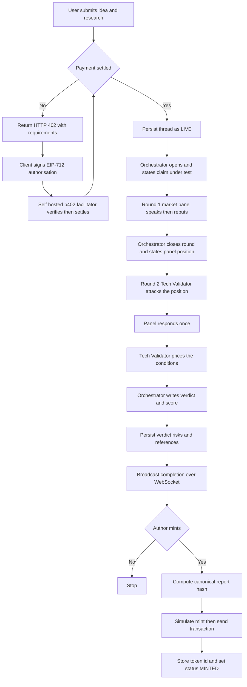

# The Council — MVP Architecture

| | |
|---|---|
| **Version** | 2.4 |
| **Status** | Approved |
| **Date Created** | 2026-09-22 |
| **Last Updated** | 2026-09-23 |

| Version | Date | Change |
|---|---|---|
| 2.4 | 2026-09-23 | **Closed.** Status set to Approved (closest defined value to "closed" in the AGENTS.md §7 enum — flag if a different label was meant). This is the last edit to this document. It remains the top-level architecture and scope reference; each remaining item in §10 gets its own workplan under `docs/plans/` before implementation, one feature per document, not folded back in here. |
| 2.3 | 2026-09-23 | §2 — corrected the real deadline: code-complete target is 25 September, not the 30 September submission date; the user needs 26–29 Sep for pitch deck, demo recording, and manual testing. Un-cut WebSocket streaming and the full b402 rail — both confirmed full scope, no simplification. §10 rewritten from a day-by-day schedule (which wrongly budgeted remaining work as human workdays) to a dependency-ordered task list, with items 5 and 8 marked as parallelizable against the frontend work rather than sequential. |
| 2.2 | 2026-09-23 | §8 — restored the BNB Agent Studio / ERC-8183 out-of-scope decision, which was made verbally during the ERC-8004 research pass but never written down; it was lost when this document was rewritten wholesale for v2.0. Recorded now so it doesn't resurface as unresolved scope. |
| 2.1 | 2026-09-23 | §10 — replaced Drizzle with Sequelize (user's ORM choice, verified working on Bun); reordered the schedule so the debate engine runs standalone against a hardcoded idea on Day 1, before any persistence or UI work, per the agreed "engine first" sequencing; recorded the Day 0 infra work (models, migration, config split) already completed ahead of schedule |
| 2.0 | 2026-09-23 | **Scope rewritten against a 7-day deadline (hackathon submission closes 30 Sep 2026), invalidating the v1.x plan.** §1 Problem Statement narrowed to Web3-native builders. §3 Definition of Done cut from 13 criteria to 9 and made day-bounded. §4.3 Termination changed from dynamic rounds with caps to fixed 2 rounds. §4.4 Model routing added — hybrid, Orchestrator on `deepseek-v4-pro`, panel and validator on `deepseek-flash`; corrects the retired `deepseek-chat` in the v1.x scaffold config. §4.5 Prompt ordering rule added for prefix caching. §4.6 Payment rail changed from hosted b402 to a self-hosted b402 facilitator, price raised from 0.05 to 1 USDT. §4.7 Reputation Registry writes cut from scope. §9 Business model section added, recording what was kill-tested and what died. §10 Day-by-day schedule added. |
| 1.1 | 2026-09-22 | §4.5 On-chain layer — added the verified canonical registry address table for BSC Testnet and Mainnet, plus the refuted-address note, so the addresses are not left as an ellipsis |
| 1.0 | 2026-09-22 | Initial draft |

---

## 1. Problem Statement

A Web3 founder commits months of engineering and $5,000–$150,000 of audit budget to a protocol design before anyone has seriously attacked the assumption underneath it. The attack that matters — someone who wants the idea to fail, arguing against someone who wants it to succeed, both citing evidence — is expensive and rare.

Asking a single AI model does not substitute. Chat models are trained to be agreeable; ask one to critique your idea and it finds merit, performs harshness for one message when pushed, then drifts back to balance. That is a property of the training, not a prompt you can write around. What is missing is not intelligence, it is an adversary with a mandate.

The Council replaces the agreeable reviewer with a panel structurally required to disagree, and publishes the whole exchange as a permanent artifact on BNB Chain.

> [!IMPORTANT]
> **The Council is not a security audit and must never be positioned as one.** It reasons about demand, token economics, distribution, and whether a design is buildable. It does not read Solidity and will not find a reentrancy bug. Any pitch claiming it reduces audit cost or prevents exploit losses is making a claim the product cannot back, and collapses under the first question.

---

## 2. Deadline Reality

Submission closes **30 September 2026**, but that is not the build deadline. The user needs 26–29 September for the pitch deck, demo recording, and manual testing. **The real target is code-complete and end-to-end working by 25 September 2026.** This plan is written on 23 September 2026, ~23:20 WIB — roughly a day and a half of wall-clock time remains before that target.

No scope is cut for this deadline. WebSocket streaming and the full b402 payment rail are both in, confirmed 2026-09-23. The constraint is not effort — do not pace this against human workday budgets (there are none here); the real bottlenecks are external latency that cannot be shortened (an LLM debate run takes ~150 seconds regardless of who is coding; blockchain confirmations take real time) and the time the user needs to review, test manually, and give direction. Sequence work to keep those bottlenecks off the critical path, not to fit a day count.

§10 lists the remaining work in dependency order, not calendar days.

---

## 3. Definition of Done

| # | Criterion |
|---|---|
| 1 | A connected wallet can submit an idea plus supporting research and open a thread. |
| 2 | Opening a thread requires a settled 1 USDT payment through a self-hosted b402 facilitator on BSC Testnet. |
| 3 | All five agents hold ERC-8004 identities on the canonical BSC Testnet Identity Registry, and their `agentId`s are visible in the thread view. |
| 4 | Round 1 runs the market panel: three analysts speak, then rebut each other by name with a quoted line. Round 2 hands their position to the Tech Validator, who attacks it. |
| 5 | The Orchestrator publishes a verdict with status line, consensus score 0–100, risk list, conclusion, and the remaining unproven gap. |
| 6 | Every substantive post carries at least one numbered citation. |
| 7 | Turns stream to the browser over WebSocket with a typing indicator for the speaking agent. |
| 8 | A finished thread can be minted — `CouncilReportRegistry` holds the report hash, score, and participating `agentId`s — and the status flips to `MINTED`. |
| 9 | Home, Forum, Thread, and the New Thread composer match the approved light design 1:1. |

Ship gate: `bun run typecheck`, `bun run lint`, `bun run build`, and `forge test` pass, and a recorded demo exists.

---

## 4. Feature Description

### 4.1 Council composition

Mandates are Web3-native. The three analysts are chosen to conflict; convergence is meaningful only because the starting positions are opposed.

| Key | Agent | Mandate |
|---|---|---|
| `orc` | The Orchestrator | Set speaking order, close each round, write the verdict |
| `m1` | Market Analyst α | Demand — is there real, sized demand on-chain |
| `m2` | Market Analyst β | Token economics and pricing — does the model hold, will anyone pay |
| `m3` | Market Analyst γ | Distribution and GTM — how does this reach users in this ecosystem |
| `tech` | Tech Validator | Is the on-chain architecture buildable, at what cost and what timeline |

### 4.2 Debate flow

Round 1, market validation: the Orchestrator opens by stating the claim under test and holds the Tech Validator out. The three analysts speak in order, then each rebuts another by name, quoting the specific sentence attacked. The Orchestrator closes the round with the panel's position — reframing it if the analysts are still opposed.

Round 2, technical feasibility: the Tech Validator attacks that position, the panel gets one response, the Tech Validator prices the conditions under which it ships.

Close: the Orchestrator writes the verdict.

### 4.3 Termination — fixed, not dynamic

Two rounds, fixed turn count. No convergence loop, no caps, no state machine.

> [!IMPORTANT]
> **This reverses the v1.x design deliberately.** Dynamic rounds judged by an Orchestrator are the better product and should return after the deadline. Under seven days they are the wrong call: unpredictable latency on stage, unpredictable cost, and a convergence judgement that is the hardest thing in the system to get right. The convergence *criteria* survive as prompt instructions for how the Orchestrator closes a round — they are no longer a control-flow mechanism.

Convergence criteria, as prompt guidance: no analyst holds an objection that was raised and never answered; there is a single position statement all three would sign; any remaining disagreement is about magnitude or conditions, not direction. Unanimous rejection is a converged position — convergence is not agreement that the idea is good.

### 4.4 Model routing

| Role | Model |
|---|---|
| Orchestrator | `deepseek-v4-pro` |
| Market panel, Tech Validator | `deepseek-flash` |

The Orchestrator carries the only genuinely hard judgement and has the fewest calls, so cost is spent where it matters and volume is cheapest. Estimated ~$0.006 per thread off-peak against a 1 USDT price.

> [!WARNING]
> **`deepseek-chat` and `deepseek-reasoner` were retired on 24 July 2026 and are inaccessible.** The v1.x scaffold config in `backend/src/config/env.ts` still names them and must be corrected. Only `deepseek-flash` and `deepseek-v4-pro` exist.

Peak hours are 01:00–04:00 and 06:00–10:00 UTC Monday–Friday, and cost exactly double. Output tokens dominate the bill — output cannot be cached and is roughly 4x the price of a cache-missed input token — so agent verbosity is the real cost lever, not cache tuning.

### 4.5 Prompt ordering for prefix caching

A cache hit only occurs on a prefix already sent in a previous call. New text is always a miss on first send, so 100% cache hit is impossible by definition; ~85–87% is the practical ceiling.

To reach it, every call composes its prompt in exactly this order:

```
system prompt  →  submitted idea  →  submitted research  →  thread so far  →  agent role instruction
```

> [!CAUTION]
> **The agent role instruction goes LAST, and the prefix is append-only.** If role instructions come first, each of the five agents starts its own cache lineage and the idea and research are paid as a cache miss five times instead of once. Never reorder the thread, never inject a timestamp or random id into the prefix, and keep the system prompt byte-identical across calls — any of these invalidates the cache and multiplies input cost by roughly fifty.

### 4.6 Payment rail

| Parameter | Value |
|---|---|
| Protocol | b402 (x402-compatible, BSC-native), **facilitator self-hosted** |
| Network | BSC Testnet, chainId 97 |
| Asset | USDT `0x337610d27c682E347C9cD60BD4b3b107C9d34dDd` |
| Decimals | **18** — read from chain at boot and asserted against config |
| Price | 1 USDT = `1000000000000000000` atomic |

> [!CAUTION]
> **The hosted b402 facilitator is gone — the repo was archived 23 April 2026 and `facilitator.b402.ai` no longer resolves.** The facilitator source is MIT-licensed and present in the archived repo under `b402-facilitator/`; it is a plain Express service needing a BSC RPC, a relayer key and address, and a Supabase instance, and it already supports chainId 97. We vendor and run it ourselves. Do not point any environment at the dead hosted URL.

> [!WARNING]
> **BSC testnet USDT has 18 decimals, not 6.** A 6-decimal assumption carried over from Ethereum or Base tooling underpays by twelve orders of magnitude. Derive every amount from an on-chain `decimals()` read.

### 4.7 On-chain layer

| Concern | Mechanism |
|---|---|
| Agent identity | `register(agentURI, metadata)` on the canonical BSC Testnet Identity Registry, once at bootstrap |
| Report attestation | Our own `CouncilReportRegistry`, ERC-721, one token per minted report |
| Agent reputation | **Cut from this scope** — see §8 |

Canonical registries, each confirmed to have deployed code via `eth_getCode` on 2026-09-22:

| Chain | Registry | Address |
|---|---|---|
| BSC Testnet (97) | Identity | `0x8004A818BFB912233c491871b3d84c89A494BD9e` |
| BSC Testnet (97) | Reputation | `0x8004B663056A597Dffe9eCcC1965A193B7388713` |
| BSC Testnet (97) | Validation | **does not exist** |

The Identity Registry was probed with `eth_call`: `name()` returns `AgentIdentity`, `symbol()` returns `AGENT`, `supportsInterface(0x80ac58cd)` returns true.

> [!CAUTION]
> **Do not use `0xfA09B3397fAC75424422C4D28b1729E3D4f659D7`.** It has code and is a real ERC-8004 Identity Registry, which makes it easy to adopt by mistake, but it belongs to BRC8004 — a separate mainnet-only fork with no testnet deployment.

`CouncilReportRegistry` stores per token: `reportHash` (keccak256 of the canonical serialised thread), `consensusScore`, `agentIds[]`, `author`, `mintedAt`, and a metadata `uri`. It emits an event shaped to mirror ERC-8004's `validationResponse` so that, if the Validation Registry ever stabilises and deploys to BSC, migration is a replay rather than a rewrite.

> [!IMPORTANT]
> **The report hash is computed over a canonical serialisation, not over rendered prose.** Field order, whitespace, and reference ordering are fixed and documented, or the same thread hashes differently on two machines and every verification fails.

---

## 5. Data Design

```
agents            key, name, role, mandate, agent_id_onchain, colour_token, agent_uri
threads           id, public_ref, title, idea, research, author_address, status,
                  consensus_score, report_hash, token_id, opened_at, closed_at
thread_posts      id, thread_id, agent_key, round, sequence, body, confidence,
                  quote_of_post_id, quote_who, quote_text, created_at
post_references   id, post_id, ordinal, label, url
verdicts          thread_id, status_text, score, note, conclusion, unproven_gap
risks             id, thread_id, ordinal, label, severity, note
payments          id, thread_id, payer_address, asset, amount_atomic, tx_hash, status
```

`threads.status` is `LIVE`, `MINTED`, or `REVISE`, matching the forum filter chips. Amounts use `NUMERIC(78,0)` to hold raw uint256 without float loss.

---

## 6. Flowchart



---

## 7. UI/UX

Four surfaces, 1:1 from the approved light design: **Home**, **Forum index** with `All / Live / Minted / Revise` filters, **Thread** with round dividers and the verdict card, and the **New Thread composer** modal. Lo-fi wireframes for each are unchanged from v1.1 and are not reproduced here.

Design tokens are already in `frontend/app/globals.css`. Fonts are Outfit for display, Inter for body, JetBrains Mono for hashes and scores.

| Surface | Loading | Empty | Error |
|---|---|---|---|
| Forum | Skeleton rows | "No threads yet — start the first one" | Retry banner, list preserved |
| Thread | Typing indicator under last post | n/a | Turn-level retry, prior turns preserved |
| Composer | Button spinner, inputs locked | n/a | 402 shows a payment step, not a failure |
| Mint | Simulation state before wallet popup | n/a | Formatted revert reason, never raw RPC text |

---

## 8. Cut From Scope

| Item | Why |
|---|---|
| Dynamic rounds with convergence loop and turn caps | Unpredictable latency and cost on stage; the hardest judgement in the system. Criteria survive as prompt guidance (§4.3) |
| Reputation Registry writes | Least visible thing in a demo. Also conceptually unresolved — feedback is client-scoped, so it measures submitter satisfaction rather than agent accuracy |
| Selling to grant programs | Kill-tested and dead — see §9 |
| BNB Agent Studio, ERC-8183 | Researched during ERC-8004 verification, 2026-09-22. Agent Studio is a separate opinionated hosted stack (its own wallet layer, LLM aggregator, hosted runtime) that would constrain rather than help — we call the canonical Identity Registry directly with viem in ~20 lines, no toolkit needed. ERC-8183 is an agentic-commerce escrow standard for agents hiring each other; the five council agents don't transact with each other, so it doesn't apply. Not revisited unless a future workplan needs agent-to-agent payment. |
| Mainnet deployment | Testnet only |

---

## 9. Business Model — Explicitly Unvalidated

Recorded here so the pitch does not overclaim, and so the reasoning is not lost.

**Working bet:** Web3 builders, roughly 1 USDT per debate. They already hold a wallet, gas, and USDT, which removes the onboarding friction that would otherwise dominate a sub-dollar purchase. The design's own example threads — a BEP-20 vesting launchpad, merchant float routed to a yield vault, on-chain rights splits, gasless stablecoin checkout — were already Web3-native before this was made explicit.

**The 1 USDT is a working price, not a proven one.** At ~$0.006 cost per thread the margin is not the constraint; demand is.

**What was kill-tested and died: selling AI-assisted screening to grant programs.** Four independent reasons, each sufficient alone:

| Finding | Evidence |
|---|---|
| The documented pain is allocation integrity — sybil attacks, undisclosed conflicts of interest, post-grant misuse — not judgement quality | RetroPGF 3, Arbitrum STIP, Uniswap Foundation incidents |
| Every program answered criticism with governance changes, never a software purchase | Optimism revised its voting algorithm four times; Arbitrum adopted a conflict-of-interest policy |
| The on-chain attestation differentiator is already a free native primitive in the buyer's own stack | Optimism publishes grant decisions as EAS attestations |
| AI evaluation of funding applications is actively prohibited or rejected | NIH bans generative AI in peer review (NOT-OD-23-149); ERC and Horizon Europe bar delegating evaluation to AI; Candid 2025 (n=529) found 97% of foundations do not use it and 66% have no plans |

**What remains genuinely unknown:** whether builders pay for validation specifically, and how often one person needs it. No idea-validation tool has reached #1 Product of the Day on Product Hunt between 2021 and 2026, peaking around 552 upvotes against a ~1,000 benchmark — the category attracts attention reliably but has never broken out, and it is crowded.

**Cheapest available validation is Demo Day itself** — ask five builders what they would use it for and where they would pay, rather than reasoning further.

---

## 10. Remaining Work, in Dependency Order

Not a day-by-day calendar — see §2. Ordered so nothing starts before what it depends on is verified, and so external-latency steps (LLM calls, chain confirmations) run while other work continues rather than blocking it.

| # | Work | Depends on | Status |
|---|---|---|---|
| 1 | Sequelize models, migration, config split | — | **Done**, verified against local Postgres |
| 2 | Standalone council graph (LangGraph, 5 agents, fixed 2 rounds, prompt ordering) | 1 | **Done**, one live run judged genuinely adversarial — see `council-debate-engine.md` |
| 3 | Thread/post repositories wrapping the models; API routes to open a thread and fetch its state | 1, 2 | Next |
| 4 | WebSocket streaming of turns as the graph produces them | 3 | In scope, full — not simplified |
| 5 | Self-hosted b402 facilitator (vendored from the archived repo's `b402-facilitator/`) + payment gate in front of thread creation | — (parallel to 3/4, no shared dependency) | In scope, full — not simplified |
| 6 | Frontend: Home, Forum index, New Thread composer | 3 | — |
| 7 | Frontend: Thread view — posts, quotes, citations, round dividers, verdict card, live via WebSocket | 4, 6 | — |
| 8 | `CouncilReportRegistry` contract + tests; deploy to BSC Testnet; register the 5 agents against the canonical Identity Registry; mint flow with `simulateContract` | — (parallel, no shared dependency) | — |
| 9 | End-to-end pass: submit → pay → debate streams live → verdict → mint, on testnet, for real | 4, 5, 7, 8 | — |

Items 5 and 8 have no dependency on the frontend work and should run in parallel with it, not after it.

---

## 11. Verification Plan

### 11.1 Automated tests

| Area | Test |
|---|---|
| Debate | Round 2 never starts before round 1 has produced a panel position |
| Debate | Every substantive post carries at least one reference |
| Prompting | Composed prompt places role instruction last and the shared prefix is byte-identical across agents |
| Report hash | Same thread serialised twice produces an identical hash |
| Report hash | Reordering references changes the hash — canonical ordering is enforced |
| Payment | Request without payment returns 402 with well-formed requirements |
| Payment | Amount derives from an on-chain `decimals()` read; an 18-decimal asset yields `1e18` for 1 USDT |
| Payment | A replayed payment authorisation is rejected |
| Contract | Only the configured minter can mint |
| Contract | Minting the same report hash twice reverts |
| Contract | Token stores score, hash, and agent ids exactly as supplied |
| Chain | Identity registration is idempotent — re-running bootstrap creates no duplicate agents |

### 11.2 Manual verification

1. Connect a wallet on BSC Testnet holding testnet BNB and USDT; the wallet pill shows the truncated address.
2. Submit an idea with research; the title auto-summarises as you type.
3. The payment step appears, the wallet prompts for an EIP-712 signature, settlement completes before any agent speaks.
4. The thread streams live — typing indicator moves between agents, rebuttals render with the quoted line of the agent being attacked.
5. The round divider changes only after the Orchestrator states the panel position.
6. Every substantive post shows numbered citations and the verdict aggregates them.
7. Mint a finished thread; simulation runs before the wallet popup, status flips to `MINTED`, and the on-screen report hash matches the value on BscScan.
8. Reload the thread; the persisted view matches what was streamed, with no lost or reordered posts.
9. Check every surface at 375px, 768px, and 1440px against the approved design.
