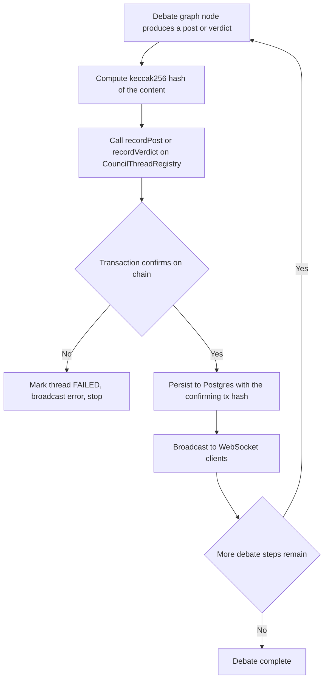

# On-Chain Thread Registry (Chain-First AI Recording)

| | |
|---|---|
| **Version** | 1.8 |
| **Status** | Draft |
| **Date Created** | 2026-09-24 |
| **Last Updated** | 2026-09-24 |

| Version | Date | Change |
|---|---|---|
| 1.8 | 2026-09-24 | Corrected a layering violation: `ThreadsController` was directly orchestrating business logic (UUID generation, hashing, calling `threadRegistryService`/`paymentGateway`/`debateRunner` directly) instead of delegating to a service. Extracted all of it into a new `ThreadService` (with a `ThreadServiceError` carrying the failure code); the controller is now genuinely thin — parse request → call one service method → map the result or a `ThreadServiceError` to the response envelope, nothing else. Re-verified clean end-to-end after this change: submitted a fresh real thread, watched all 11 posts and the verdict arrive over the actual WebSocket, then independently queried `CouncilThreadRegistry.getThread()` on-chain and confirmed an exact match against Postgres — same 11 posts in the same order with the same agent IDs (2467 `orc`, 2471 `m1`, 2468 `m2`, 2469 `m3`, 2470 `tech`), same verdict score (14). An earlier verification run was accidentally corrupted by running `bun test` (which truncates the `threads` table) against the same shared database while a live debate was still in-flight — not a bug in the on-chain-first logic, just two things sharing one database; re-ran clean afterward. |
| 1.7 | 2026-09-24 | Full backend restructure implemented and verified. All repositories (`ThreadRepository`, `ThreadPostRepository`, `VerdictRepository`, `PaymentRepository`) are now classes; `ThreadsController` replaces the plain-function controller and now calls `openThread` synchronously as part of `POST /threads` — before the Postgres row even exists (a fresh UUID is generated up front, hashed, opened on-chain, and only reused as the Postgres primary key if that succeeds); `DebateRunner` (was `run-and-persist.ts`) gates every single post and the verdict behind a prior real on-chain confirmation, with agent-id resolution extracted into an injectable `AgentIdLookup` so tests can stub it without touching shared Postgres state. Updated all 6 existing test files to the new class-based API rather than leaving them broken; fixed a real bug this surfaced along the way — a hardcoded test fixture address (`0x000...dEaD`) turned out to not be EIP-55 checksum-valid, which only started mattering once thread creation began making a real signed contract call. Full suite: 31 pass, 1 intentionally-skipped (real-LLM) test, 0 fail. Verified live end-to-end against the real running backend: submitted a real thread, watched real posts arrive over the actual WebSocket, and cross-checked directly against the deployed contract's `getThread()` that the same posts (correct agentId, correct content hash, correct timestamp) were genuinely recorded on-chain — not just asserted by the app. |
| 1.6 | 2026-09-24 | Scope correction: v1.5 only converted the chain-interaction layer (`service/chain/*`) to classes — the rest of the backend (repositories, the `threads` controller, `run-and-persist.ts`) was still the original plain-function style, which undersold what "OOP" meant here. This version converts all of it: `ThreadRepository`, `ThreadPostRepository`, `VerdictRepository`, `PaymentRepository` become classes; `ThreadsController` becomes a class wrapping the Elysia route handlers; `FacilitatorClient`/`PaymentGateway` replace the plain `facilitator-client.ts`/`gate.ts` functions; `run-and-persist.ts` becomes a `DebateRunner` class — and this is where the actual on-chain-first wiring (§3/§5, previously only built as standalone services, never actually plugged into the debate loop) is implemented for real. Deliberately **not** touched: the five `createXAgent()` factories under `service/agent/{orchestrator,market-analyst-*,tech-validator}` — those were already corrected to this exact factory-function shape earlier in the session after an explicit rejection of a class/loop-based version; converting them back to classes now would undo that correction, not honor this one. |
| 1.5 | 2026-09-24 | Real BSC Testnet milestone: all 5 agent wallets funded with real tBNB (0.001 each, sent from an already-funded external wallet) and registered their real ERC-8004 identity live on BSC Testnet (not just the fork) — `orc`=2467, `m2`=2468, `m3`=2469, `tech`=2470, `m1`=2471. `agents.agent_id_onchain` populated with these real values. Restructured `backend/src/service/chain/*` into OOP classes (`ChainClient`, `ReportMintingService`, `AgentIdentityService`, `ThreadRegistryService`), replacing the old loose-function `client.ts`/`mint-report.ts`. Refreshed the local Anvil fork so it reflects the new real testnet registrations, redeployed every fork-local contract (`CouncilReportRegistry` landed back at its same deterministic address; `CouncilThreadRegistry`, `B402RelayerV2`, `MockUSDT`, `CouncilTreasuryVault` at new addresses, all updated in `.env`). Verified end-to-end through the actual class layer (not raw `cast`): `openThread`, `recordPost` as `m1` under its own identity, and `recordVerdict` as `orc` under its own identity all confirmed on-chain. |
| 1.4 | 2026-09-24 | Implemented and verified on the local Anvil fork: all 5 agents registered their own real ERC-8004 identity (`orc`=2468, `m1`=2469, `m2`=2465, `m3`=2466, `tech`=2467 — confirmed via each wallet's own real `IdentityRegistry.register()` transaction, not assigned). Redeployed `CouncilThreadRegistry` wired to the real IdentityRegistry. Proved the authorization model with a real adversarial test: `m1` recording its own post under its own agentId succeeded; `m2` then attempting to record a post claiming `m1`'s agentId (impersonation) correctly reverted with `"Not this agent's registered wallet"`. |
| 1.3 | 2026-09-24 | Two scope changes agreed this round. (1) Thread creation itself now goes through the same registry — `openThread` is called the moment a thread is submitted (`POST /threads`), not scoped out as a later-only concern; closes the §11 open question from v1.0/1.1. (2) Each of the 5 AI agents gets its **own** wallet and its **own** ERC-8004 identity (real `IdentityRegistry.register()` call, confirmed live on both BSC Testnet and the Anvil fork — verified `name()`="AgentIdentity", `symbol()`="AGENT", real ERC-721 tokens). `recordPost`/`recordVerdict` are no longer gated by a single shared `writer` — each call must come from `msg.sender` matching that specific agent's registered wallet (checked against `IdentityRegistry.getAgentWallet(agentId)`), so an agent's on-chain actions are genuinely signed by that agent's own key, not impersonated by one shared backend key. `openThread` stays behind a single service-level writer (the human-submission path, not tied to any one agent's identity). Explicitly decided: no separate meta-transaction/relayer layer for agent actions — each agent wallet is funded directly and pays its own gas; b402's gasless mechanism is payment-specific (EIP-3009 `transferWithAuthorization`) and does not generalize to arbitrary contract calls like `recordPost`. |
| 1.2 | 2026-09-24 | Built and deployed the storage-based `CouncilThreadRegistry` to the local Anvil fork, verified `getThread()` correctly reads back the full struct (author, idea hash, verdict, and every post with all fields intact). Real measured gas, replacing the v1.1 estimate: `openThread` 93,781 · `recordPost` (first) 118,963 · `recordPost` (subsequent) ≈101,863 each · `recordVerdict` 98,610. Full 13-call submission ≈ 1,330,000 gas ≈ 0.000133 tBNB at the live 0.1 gwei testnet price — a 0.01 tBNB balance covers ≈75 submissions. |
| 1.1 | 2026-09-24 | Renamed contract from `CouncilDebateLog` to `CouncilThreadRegistry` — "Log" was rejected outright (reads as a cheap/disposable EVM event-log concept, not a real on-chain record). Redesigned storage: data lives in actual contract storage (structs in mappings), readable back via a `getThread()` view function — not just emitted events, which are cheap but not directly queryable on-chain. Added real, empirically-measured gas costs from the Anvil fork (§12): current event-only design costs ≈ 653,000 gas per full 13-call submission (≈ 0.0000653 tBNB at the live 0.1 gwei testnet gas price); the storage-based redesign in this version is estimated ≈ 1.1M gas (≈ 0.00011 tBNB) — both comfortably inside a 0.01 tBNB balance (≈150 and ≈90 submissions respectively). Real number to be re-measured once the storage-based contract is built. |
| 1.0 | 2026-09-24 | Initial draft |

> **Summary.** Today, every AI-generated post and the verdict are written to Postgres first; a hash of the whole thread only reaches the chain later, optionally, if and when the author pays to mint a report NFT — meaning the chain is not actually the source of truth for what the AI did, just a notarization of whatever the database happens to contain at mint time. This plan inverts that: every post and the verdict get a hash recorded on a new `CouncilThreadRegistry` contract **before** they are ever written to Postgres or shown to any client, stored in real contract storage (not just event logs) and readable back on-chain via `getThread()`. If the on-chain write fails, the content is rejected outright. Full text still lives in Postgres (on-chain stores hashes, not full text — deliberately, to stay honest about gas/storage limits on any chain, testnet included). The existing optional NFT mint (`CouncilReportRegistry`) is untouched and stays a separate, later, user-paid step layered on top of this.

---

## 1. Problem Statement

The product's premise is that an idea gets a trustworthy, adversarial evaluation and the record of that evaluation can't be quietly altered. As built, that guarantee only starts at the moment someone clicks "Mint" — which may be minutes, days, or never after the debate actually happened. Between debate completion and minting, the content sits in Postgres with no on-chain anchor at all; anyone with database access could edit it and nothing on-chain would know or care. The chain, as used today, attests to "this is what was in the database when minting happened," not "this is what the AI actually produced."

---

## 2. Business Rules

- Every AI-generated post and the verdict must have their content hash successfully recorded on `CouncilThreadRegistry` **before** being persisted to Postgres or broadcast to any WebSocket client.
- If the on-chain write for a given post/verdict fails, that content is rejected — not persisted, not shown. The debate run fails at that point, using the same `FAILED` status/error-broadcast path already built for other failure modes.
- On-chain stores a hash only, never full text. Full text remains the Postgres copy; its integrity is verifiable at any time by recomputing the hash and comparing it to the on-chain event.
- Scope covers thread creation, every post, and the verdict — all of it on-chain-first, not just posts/verdict. Submitting a thread calls `openThread` at submission time, same rule as the rest: reject if the on-chain call fails.
- Each of the 5 agents (`orc`, `m1`, `m2`, `m3`, `tech`) has its own wallet and its own registered ERC-8004 identity. `recordPost`/`recordVerdict` must be called by the wallet that actually owns that agent's identity — not a shared backend key impersonating all five.
- The existing optional `CouncilReportRegistry` NFT mint is unrelated and unchanged — it remains a separate, later, user-paid "portable certificate" step. This registry write is mandatory, automatic, and real-time; the NFT mint stays optional.
- Verified on the local Anvil BSC Testnet fork first. Real BSC Testnet deployment is a separate, later step, gated behind funding and explicit permission — unchanged from every other on-chain piece this session.

---

## 3. Approach / Solution Overview

A new contract, `CouncilThreadRegistry`, exposes `openThread`, `recordPost`, and `recordVerdict`. Each call writes into real contract storage (a `Thread` struct holding the author, idea hash, and an array of post entries, plus the verdict), not just an emitted event, and a `getThread(threadId)` view function reads the whole record back on-chain. Events are still emitted alongside the storage writes (useful for off-chain indexing) but are not where the data actually lives.

Authorization is split by who is actually acting: `openThread` (triggered by a human submitting a thread, not by any one agent) stays behind a single service-level `writer` address. `recordPost`/`recordVerdict` (an agent's own output) instead require `msg.sender` to match that specific agent's registered wallet — checked by calling the real `IdentityRegistry.getAgentWallet(agentId)` and comparing it to `msg.sender`. Each of the 5 agents registers its own ERC-8004 identity (`IdentityRegistry.register()`, called by that agent's own wallet) ahead of time; the resulting `agentId` is stored in the already-existing (currently empty) `agents.agent_id_onchain` column.

`run-and-persist.ts` is restructured so that for every debate-graph update, the order becomes: compute the content hash → call the matching on-chain function from the correct wallet (service writer for thread-open, that specific agent's own wallet for its posts/verdict) → wait for the transaction receipt → **only then** write to Postgres and broadcast over the WebSocket. A failed on-chain call is treated exactly like today's other debate failures (thread marked `FAILED`, error broadcast, nothing partial persisted).

| Option | Pros | Cons |
|---|---|---|
| **One on-chain transaction per post, gating persistence** (chosen) | Chain genuinely becomes the source of truth for every step, not just the end result; matches the explicit requirement that on-chain input succeed before anything is accepted | Adds one on-chain round-trip per post (~11 per debate) to debate latency |
| Batch all posts into a single transaction at the end | Cheaper, one transaction | Structurally identical to what exists today (a late, optional commit) — doesn't solve the actual problem |
| Full post text stored on-chain | Content itself unrecoverable-proof even if Postgres is lost | Rejected — explicit decision this round: real gas/storage cost and practical block-gas-limit risk on long posts, on any chain including testnet |

---

## 4. Database / Data Design

No new tables. Two small additions:

| Table | Change |
|---|---|
| `thread_posts` | Add `thread_registry_tx_hash VARCHAR(66)` — the confirming on-chain transaction, for traceability/debugging |
| `verdicts` | Add `thread_registry_tx_hash VARCHAR(66)` — same |
| `agents` | Backfill `agent_id_onchain` with stable small integers (`orc`=0, `m1`=1, `m2`=2, `m3`=3, `tech`=4) — currently `NULL` for all five rows; this is the `agentId` `recordPost` needs. Unrelated to and does not change how `CouncilReportRegistry.mint()` already consumes this column. |

---

## 5. Flow Diagram

---

## 6. Event Summary Table

| Event | On-chain | Off-chain (Postgres) |
|---|---|---|
| Thread opened | `ThreadOpened(threadId, author, ideaHash)` emitted once, before any posts | Thread row already exists (created by the payment-gated `POST /threads` handler, unchanged) |
| Each post generated | `PostRecorded(threadId, agentId, round, sequence, contentHash)` must confirm first | Post row written only after on-chain confirmation, tagged with the confirming tx hash |
| Verdict reached | `VerdictRecorded(threadId, score, verdictHash)` must confirm first | Verdict row written only after on-chain confirmation, tagged with the confirming tx hash |
| On-chain write fails (any of the above) | Nothing recorded | Nothing persisted; thread flips to `FAILED`, matching the existing failure path |

---

## 7. Scenario Walkthrough

**Happy path.** All 11 debate steps each confirm on-chain in turn; each post/verdict appears in Postgres and over the WebSocket only after its own confirmation. Indistinguishable to the end user from today's flow, just with a real integrity guarantee underneath.

**On-chain write fails mid-debate.** Say post 6 of 11 fails to confirm (RPC hiccup, writer wallet out of gas, etc.). Posts 1–5 are already legitimately confirmed and persisted — they stay visible. Post 6 is never written or shown. Thread flips to `FAILED`, same UI/error-banner behavior already built and verified for the existing `GraphRecursionError` case.

**Local fork restart mid-debate.** Same class of problem this session already hit once with `CouncilReportRegistry` — if the Anvil fork is restarted, in-flight debates lose their on-chain state. Not a new risk introduced by this plan, same recovery procedure as before (redeploy, same deterministic address if same deployer+nonce).

---

## 8. Impacted Files / Components

| Layer | File | Action |
|---|---|---|
| Smart contract | `smart-contract/src/CouncilThreadRegistry.sol` | NEW — already drafted and gas-tested this round |
| Backend | `backend/src/abi/CouncilThreadRegistry.ts` | NEW — ABI export, same pattern as `CouncilReportRegistry.ts` |
| Backend | `backend/src/abi/IdentityRegistry.ts` | NEW — ABI export for the real ERC-8004 IdentityRegistry (`register`, `getAgentWallet`, `ownerOf`) |
| Backend | `backend/src/config/env.ts` | MODIFY — add `THREAD_REGISTRY_ADDRESS`; add one private key env var per agent (`ORC_PRIVATE_KEY`, `M1_PRIVATE_KEY`, `M2_PRIVATE_KEY`, `M3_PRIVATE_KEY`, `TECH_PRIVATE_KEY`) |
| Backend | `backend/src/service/chain/thread-registry.ts` | NEW — `openThread()`/`recordPost()`/`recordVerdict()` wrappers, simulate→write→wait pattern matching `mint-report.ts`, each using the correct agent's wallet client |
| Backend | `backend/src/service/chain/agent-identity.ts` | NEW — one-time `registerAgentIdentity()` helper (calls `IdentityRegistry.register()` from an agent's own wallet) |
| Backend | `backend/src/service/agent/run-and-persist.ts` | MODIFY — the core rewrite: gate every persist+broadcast behind a prior on-chain confirmation, using the correct agent wallet per call |
| Backend | `backend/migrations/00X_add_thread_registry_columns.sql` | NEW — `thread_registry_tx_hash` columns; `agent_id_onchain` finally gets real values (currently `NULL` for all 5 rows) |
| Backend | `backend/src/repository/ThreadPostRepository.ts`, `VerdictRepository.ts` | MODIFY — accept and store the confirming tx hash |
| Backend | `backend/src/http/controllers/threads.ts` | MODIFY — `createThreadHandler` calls `openThread` before creating the Postgres row |

---

## 9. Data Migration / Backfill Strategy

Threads created before this change have posts/verdicts with no on-chain record at all. No retroactive backfill is attempted — minting old content on-chain now wouldn't prove anything about when it was actually generated. Those existing threads remain queryable as-is; only debates started after this ships get the chain-first guarantee. This is a known, disclosed limitation, not silently glossed over.

---

## 10. Decisions Requiring Review

> [!IMPORTANT]
> **Real BSC Testnet rollout is a separate, later step.** Everything here is built and verified against the local Anvil fork first, per standing practice this session. Deploying `CouncilThreadRegistry` for real, and funding the writer wallet with real BNB, needs explicit permission when that time comes — same gate as the payment-rail contracts.

> [!IMPORTANT]
> **Added latency.** Each on-chain confirmation adds real wall-clock time per post — negligible on the local Anvil fork, but on real BSC Testnet (~3s blocks) roughly 30+ seconds added across an 11-post debate. Small relative to the multi-minute LLM generation time already involved, but a real, disclosed cost of this design, not zero.

> [!IMPORTANT]
> **Five wallets need funding, not one.** Each agent registering its own ERC-8004 identity and submitting its own posts means 5 separate wallets each need real BNB for gas once this goes to real BSC Testnet (registration is itself a paid transaction, once per agent, plus ongoing per-post gas). Explicitly decided against a shared relayer for this (see v1.3 changelog) — direct funding, kept simple. Still on the local Anvil fork for now, so no real cost yet.

---

## 11. Open Questions

None blocking — the two points open as of v1.2 (thread-creation scope, ERC-8004 identity) were both resolved this round; see the v1.3 changelog entry.

---

## 12. Verification Plan

### Automated tests

None — same reasoning as every other on-chain-integration plan this session: verified manually against the real (locally-forked) chain rather than mocked.

### Manual verification

1. `forge build` clean for the new contract; deploy to the local Anvil fork.
2. Submit a real thread; confirm via `cast logs` that a `PostRecorded`/`VerdictRecorded` event lands for every post, and that the event's `contentHash` matches an independently recomputed hash of the Postgres row's content.
3. Confirm the WebSocket/Postgres write for a given post only happens strictly after its on-chain confirmation (not concurrently, not before) — observable via timing/log ordering.
4. Simulate an on-chain failure (e.g. point `DEBATE_LOG_ADDRESS` at a wrong/paused contract, or use a writer key the contract doesn't recognize) and confirm the thread correctly flips to `FAILED` with no partial post written for the step that failed.
5. Confirm the existing free-flow and payment-gated flows both still work unchanged up to the point this plan touches (thread creation itself untouched).
