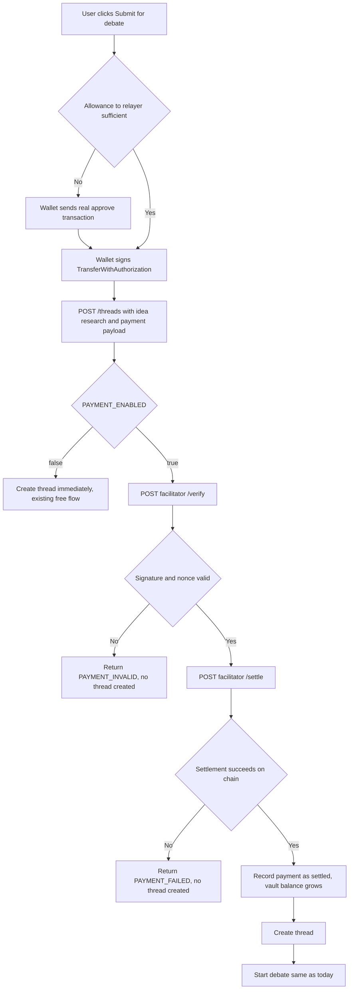

# Council Payment Rail (b402 Gate on Thread Submission)

| | |
|---|---|
| **Version** | 1.3 |
| **Status** | In Review |
| **Date Created** | 2026-09-24 |
| **Last Updated** | 2026-09-24 |

| Version | Date | Change |
|---|---|---|
| 1.3 | 2026-09-25 | Deployed `B402RelayerV2`, `MockUSDT`, `CouncilTreasuryVault` for real on BSC Testnet (not the Anvil fork). Root cause of "no allowance prompt in the browser": the connected MetaMask wallet talks to real BSC Testnet, where the fork-only contracts never existed, so the composer's on-chain `allowance` read silently found nothing to gate against. `PAYMENT_ENABLED` flipped to `true` for real. Minted 1000 real mUSDT to the actual wallet used for browser testing, funded the facilitator's relayer wallet with real tBNB for settlement gas. Only the payment layer needed to move to real testnet — `CouncilReportRegistry`/`CouncilThreadRegistry` correctly stay on the Anvil fork where they're actually deployed; the composer's allowance/approve calls go through the connected wallet's own provider, not backend RPC config, so there's no conflict between the two living on different chains. |
| 1.2 | 2026-09-24 | Architecture changed after real findings, then fully verified end-to-end for real. (1) The shared/hosted relayer (`0xd67eF16f...`) only whitelists real USDT and we don't control its owner key, so we deploy our **own** `B402RelayerV2` instance (vendored verbatim from Vistara Labs' public repo, MIT). (2) Deployed a `MockUSDT` (owner-mintable ERC20) so demo wallets don't depend on judges having real testnet USDT. (3) `B402_PAY_TO_ADDRESS` is now a new `CouncilTreasuryVault` contract, not a bare EOA — accumulates payments as TVL, owner-gated `withdraw()`, owner set to an existing PulsarFi wallet address already used as a fee-recipient role there (a public address reuse, no private key shared across projects). (4) Confirmed via the relayer's real source that `transferWithAuthorization` requires a prior standard `approve()` from the payer — not natively gasless for that one-time step — so the composer now checks current allowance and sends a real `approve()` transaction first when needed. All of this was verified for real end-to-end, twice, through the actual `POST /threads` API (not curl-to-facilitator-only): once with a pre-approved wallet, once with a wallet that had never interacted with the relayer before (proving the new approve-if-needed path). Both landed real `settled` `payments` rows with real tx hashes and correctly grew the vault's on-chain balance. Verification ran against the local Anvil BSC Testnet fork (same one `CouncilReportRegistry` already uses) — real public BSC Testnet deployment of the three new contracts is still blocked on the deployer wallet having zero real testnet BNB; see §12. |
| 1.1 | 2026-09-24 | Implemented and verified everything short of a real on-chain settle: `facilitator-client.ts`, `gate.ts`, `PaymentRepository.ts`, controller/route wiring, frontend `signTypedData` step in the composer, `GET /payment/requirements`. Verified live: (a) `PAYMENT_ENABLED=false` free flow byte-for-byte unchanged (regression-checked against a real thread creation), (b) all four pure local rejection paths (`PAYMENT_REQUIRED`, wrong recipient, insufficient value, wrong asset) correctly reject with no orphaned thread row, (c) the self-hosted facilitator's real `/verify` endpoint against real BSC Testnet correctly validates a genuine EIP-712 signature and correctly rejects a tampered one. Deliberately did NOT exercise `/settle` — that is a real broadcast from the relayer wallet, gated behind explicit permission per §12; see that section for exactly what's left. Status → In Review pending that decision, not Implemented. |
| 1.0 | 2026-09-24 | Initial draft |

> **Summary.** Submitting an idea for debate costs 1 USDT, paid gaslessly via a self-hosted b402 facilitator (the hosted one is dead, so we run Vistara Labs' own server code ourselves). The user signs an EIP-712 `TransferWithAuthorization` once in their wallet — no separate approval transaction, no gas from them. The backend verifies the signature, settles it on-chain through the facilitator's relayer wallet, records the payment, and only then creates the thread and starts the debate. The gate is fully wired but ships behind `PAYMENT_ENABLED=false` by default so the free-flow demo path (already built and verified) keeps working; flipping it on for real requires a funded relayer wallet and a real BSC Testnet broadcast, which is explicitly gated behind user permission before it is exercised for real.

---

## 1. Problem Statement

The product's whole premise depends on submission having a real cost — that's what keeps the panel's incentive to actually validate honest rather than just rubber-stamping every idea for engagement. The composer UI already advertises "1 USDT" per submission, but nothing enforces it: `POST /threads` today creates a thread and starts a debate for anyone, unconditionally. The scaffolding for payment (a self-hosted facilitator server, a `Payment` model/table, `PAYMENT_ENABLED`/`B402_*` env vars) already exists from earlier work this session, but none of it is wired into the actual request path.

---

## 2. Business Rules

- Price is fixed at `B402_PRICE_ATOMIC` (default `1000000000000000000` = 1 unit at 18 decimals) in `B402_ASSET_ADDRESS` — our own `MockUSDT`, not real testnet USDT, so demo wallets never depend on a faucet.
- Payment goes to `B402_PAY_TO_ADDRESS` — our own `CouncilTreasuryVault` contract, not a bare EOA. Funds accumulate there as TVL; only the vault's `owner` (a PulsarFi treasury address, a public-address reuse with no shared private key) can `withdraw()`.
- A thread is only created after the payment is verified *and* settled on-chain — a valid signature alone is not sufficient, since it costs the payer nothing to produce even with zero balance. Settlement failure (insufficient balance, insufficient allowance, nonce reuse, expired authorization) must block thread creation with a clear reason, never a silent 500.
- The relayer requires a one-time on-chain `approve()` from the payer before their first ever payment can settle (confirmed from the relayer's real source — see v1.2 changelog). The composer checks current allowance and sends `approve()` automatically when needed; this is a real transaction the payer's wallet must sign and pay gas for, exactly once per (payer, token) pair.
- When `PAYMENT_ENABLED=false`, the gate is skipped entirely and the existing free flow is unchanged.
- One payment per thread. No refunds, no partial credit — out of scope for the hackathon deadline.

---

## 3. Approach / Solution Overview

Frontend obtains one EIP-712 signature via wagmi's `signTypedData` (domain `{name: "B402", version: "1", chainId: 97, verifyingContract: B402_RELAYER_ADDRESS}`, type `TransferWithAuthorization`), sends it alongside the existing idea/research/authorAddress fields to `POST /threads`. Backend gates thread creation on a synchronous verify+settle round-trip to the self-hosted facilitator before touching the `threads` table.

| Option | Pros | Cons |
|---|---|---|
| **Synchronous verify + settle before creating thread** (chosen) | Payment must actually clear on-chain before the paid resource (a full 5-agent debate, real LLM cost) is granted — no free-riding on a signature alone | Adds real on-chain settlement latency (seconds) to the submit click |
| Verify only, settle async after thread creation | Faster perceived submit | Lets a payer with zero balance start a debate for free every time — defeats the entire business rule above |

---

## 4. UI/UX Design

The composer already shows "1 USDT" as static copy. Add: a `signTypedData` prompt right when "Submit for debate" is clicked (before the network call), a distinct pending state ("Waiting for wallet signature…" → "Processing payment…" → "Submitting…"), and a payment-specific error state separate from the existing generic submit error (e.g. "Payment declined: insufficient USDT balance" vs. "Could not submit the thread").

---

## 5. Perubahan UI Existing

`frontend/components/forum/new-thread-composer.tsx` — `handleSubmit` gains a signing step before the existing `createThread()` call; no new modal, same dialog, just an extra async step and two new transient status strings in place of the current single "Submitting…" label.

---

## 6. Database / Data Design

No schema change — `payments` table and `Payment` Sequelize model already exist (migration `001_initial_schema.sql`), with `thread_id`, `payer_address`, `asset`, `amount_atomic`, `tx_hash`, `status` (`pending`/`settled`/`failed`), already indexed on `thread_id`. Association (`Thread.hasMany(Payment)`) already registered in `model/index.ts`.

Three new contracts, none touching Postgres:

| Contract | Purpose | Owner |
|---|---|---|
| `B402RelayerV2` | Verifies the EIP-712 authorization, calls `transferFrom` | us (deployer) — only role this unlocks is `setTokenWhitelist`/`pause` |
| `MockUSDT` | ERC20 we can mint into any wallet that needs test funds | us (deployer) |
| `CouncilTreasuryVault` | Holds accumulated payments as TVL, gated withdrawal | PulsarFi treasury address (per explicit request) |

---

## 7. Flow Diagram

---

## 8. Event Summary Table

| Event | What changes | What does not change |
|---|---|---|
| `PAYMENT_ENABLED=false` | Nothing — identical to today | Entire request path |
| Verify fails (bad signature, reused nonce, expired) | Request returns `400 PAYMENT_INVALID`, no `payments` or `threads` row written | No debate starts |
| Settle fails (insufficient balance, relayer out of gas, RPC error) | Request returns `402 PAYMENT_FAILED`, no `threads` row written; no orphaned `payments` row either since it's only written after settle succeeds | No debate starts |
| Settle succeeds | `payments` row written `status=settled` with real `tx_hash`, then `threads` row created, debate starts exactly as today | Everything downstream of thread creation (debate engine, Thread View, mint) — already built and verified |

---

## 9. Scenario Walkthrough

**Happy path.** Payer has ≥1 USDT testnet balance, signs once, backend verifies then settles on-chain (a few seconds), thread is created, debate starts exactly like every already-verified run this session.

**Edge case — zero balance.** Signature is valid (costs nothing to produce), verify passes, settle reverts on-chain for insufficient balance; backend returns `402 PAYMENT_FAILED` with the revert reason, no thread is created, no LLM cost is incurred.

**Error case — facilitator unreachable.** `fetch` to the facilitator throws or times out; backend returns `502 PAYMENT_FACILITATOR_UNAVAILABLE` rather than a bare 500, so the frontend can show a specific message instead of the generic submit error.

---

## 10. Impacted Files / Components

| Layer | File | Action |
|---|---|---|
| Backend | `backend/src/service/payment/facilitator-client.ts` | NEW — thin `verify()`/`settle()` wrapper over the facilitator's HTTP API |
| Backend | `backend/src/service/payment/gate.ts` | NEW — orchestrates verify → settle → record `Payment`, returns a typed result the controller branches on |
| Backend | `backend/src/repository/PaymentRepository.ts` | NEW — `createPayment`, `markSettled`, `markFailed` |
| Backend | `backend/src/http/controllers/threads.ts` | MODIFY — `createThreadHandler` calls the gate first when `env.payment.enabled`, branches on its result before calling `createThread` |
| Backend | `backend/src/http/routes/threads.ts` | MODIFY — request body accepts an optional `payment` field |
| Backend | `backend/.env`, `.env.example` | MODIFY — fix `B402_FACILITATOR_URL` default (was `4021`, facilitator actually listens on `3402`); add `B402_RELAYER_ADDRESS` |
| Backend | `backend/src/http/routes/payment.ts` | NEW — `GET /payment/requirements`, so the frontend never hardcodes contract addresses |
| Frontend | `frontend/components/forum/new-thread-composer.tsx` | MODIFY — allowance check, `approve()` if needed, then `signTypedData`, then `createThread`; new `approving`/`signing`/`submitting` states |
| Frontend | `frontend/http/threads.ts` | MODIFY — `createThread()` accepts an optional `payment` payload, `getPaymentRequirements()` added |
| Smart contract | `smart-contract/src/B402RelayerV2.sol` | NEW — vendored verbatim from Vistara Labs' public b402 repo (MIT), our own instance |
| Smart contract | `smart-contract/src/MockUSDT.sol` | NEW — owner-mintable ERC20 standing in for real testnet USDT |
| Smart contract | `smart-contract/src/CouncilTreasuryVault.sol` | NEW — TVL-holding vault, owner-gated withdrawal |

---

## 11. Data Migration / Backfill Strategy

Not applicable — no existing threads need retroactive payment records; the gate only applies going forward once enabled.

---

## 12. Decisions Requiring Review

> [!WARNING]
> **The three new contracts (`B402RelayerV2`, `MockUSDT`, `CouncilTreasuryVault`) are deployed and fully verified only against the local Anvil BSC Testnet fork — not real public BSC Testnet yet.** The deployer wallet (`0x382f758304b51ad48579B5ad00f5cE2d886F4D4d`, same one used for `CouncilReportRegistry`) has zero real testnet BNB, confirmed by checking its balance on the real chain directly. Real deployment needs either that wallet funded via a testnet faucet, or a different funded private key to use instead. Nothing was broadcast to the real chain without this being resolved first, per standing instruction.

> [!IMPORTANT]
> **Resolved by the MockUSDT decision.** The earlier "judges won't have testnet USDT" concern is now moot — MockUSDT is fully owner-mintable, so any demo wallet can be funded (and pre-approved) with a script, no faucet dependency. `PAYMENT_ENABLED=true` can now be the actual demo mode once the three contracts are deployed for real and a demo wallet is minted+approved.

> [!IMPORTANT]
> **The relayer requires the payer to hold real BNB for gas to send the one-time `approve()`.** MockUSDT solves the *token* funding problem but not the *gas* funding problem — a demo wallet also needs a small amount of real testnet BNB before it can call `approve()`. This is a much smaller ask than needing real testnet USDT, but it isn't zero.

---

## 13. Open Questions

None blocking implementation of the gate itself; the demo-mode decision above (§12) affects the pitch, not the code.

---

## 14. Verification Plan

### Automated tests

None — same reasoning as every other backend-integration plan this session: thin orchestration over a real external HTTP service and real on-chain calls, verified manually against the real (self-hosted) facilitator instead of mocked.

### Manual verification

1. `bun run typecheck`, `lint`, `build` clean, both repos. ✅
2. With `PAYMENT_ENABLED=false`: confirmed `POST /threads` behaves byte-for-byte identically to every already-verified run this session. ✅
3. All four pure local rejection paths (`PAYMENT_REQUIRED`, wrong recipient, insufficient value, wrong asset) tested against the real API with `PAYMENT_ENABLED=true`, all correctly reject with zero orphaned `threads` rows. ✅
4. Contracts built (`forge build`, clean) and deployed to the local Anvil BSC Testnet fork: `B402RelayerV2`, `MockUSDT`, `CouncilTreasuryVault`, `MockUSDT` whitelisted on the relayer. ✅
5. Direct on-chain proof (bypassing the facilitator, calling the relayer directly): minted MockUSDT to a fresh wallet, approved the relayer, signed a real EIP-712 authorization, called `transferWithAuthorization` — vault balance went `0 → 1e18`. Confirmed the vault owner (PulsarFi treasury address) can `withdraw()` the funds. ✅
6. Full real settle through the actual API, twice: (a) an already-approved wallet — `POST /threads` with a real signed payment succeeded, `payments` row landed with `status=settled` and a real `tx_hash`, thread was created. (b) a wallet that had **never** interacted with the relayer before — proved the composer's new allowance-check-then-`approve()` path by replicating it call-for-call (read allowance → 0 → send `approve()` → confirm → sign → submit), also succeeded end-to-end. ✅
7. Real public BSC Testnet deployment of the three contracts — not yet done, blocked on deployer wallet funding. See §12.
