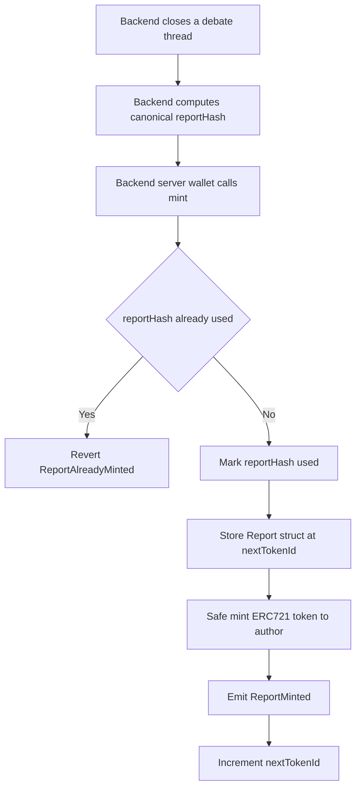
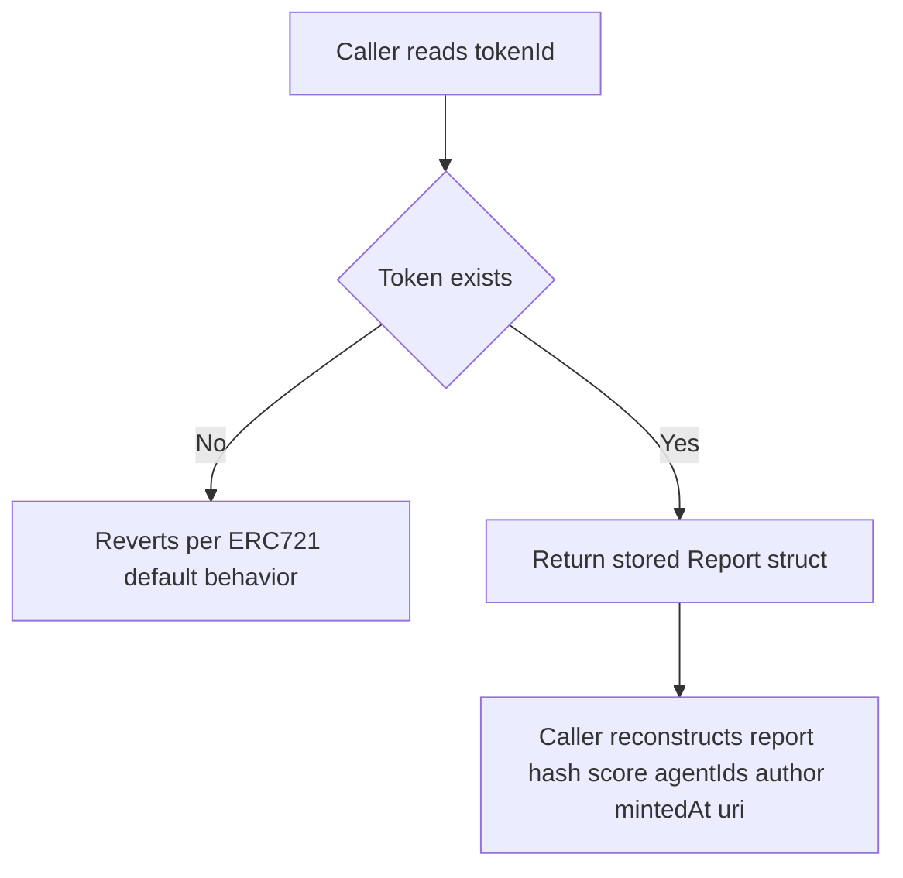

# Council Smart Contract

| | |
|---|---|
| **Version** | 1.2 |
| **Status** | Implemented |
| **Date Created** | 2026-09-23 |
| **Last Updated** | 2026-09-24 |

| Version | Date | Change |
|---|---|---|
| 1.2 | 2026-09-24 | **Real end-to-end broadcast verified against a local Anvil fork of BSC Testnet** (`anvil --fork-url <testnet RPC> --chain-id 97`), not just simulation. Genuine finding: registering with the deployer set to Anvil's famous default account #0 (`0xf39Fd6e...`, private key `0xac0974be...`) reverts consistently, on both the live testnet fork *and* a completely fresh local fork — that address has unrelated foreign contract code already deployed to it on real BSC Testnet (an artifact of the key being extremely widely used in tutorials/tests worldwide), which breaks the Identity Registry's ERC-721 `safeMint` → `onERC721Received` callback. **Fix: never use a well-known/public Anvil default key for anything that forks live chain state, even for local-only simulation** — generate a fresh keypair (`cast wallet new`) and fund it via `anvil_setBalance` instead. With a clean address, deploy → register 5 agents → mint a report → verify NFT ownership all succeeded for real (`status: 1 (success)` on every transaction) on the local fork. Local dev deployment for reference: `CouncilReportRegistry` at `0x0f334af176d2e55d597d54f5a38b48129445db37`, deployer/owner `0x382f758304b51ad48579B5ad00f5cE2d886F4D4d`, agent ids 2464–2468 — valid only on this ephemeral local fork, not a real address on any persistent network. |
| 1.1 | 2026-09-23 | Implementation complete, all 8 Definition of Done criteria verified. `forge build`: clean, no errors (three `mixed-case-variable` lint notes on `IIdentityRegistry.sol`'s `agentURI` parameter, kept as-is since it matches the canonical spec's exact parameter name verbatim — not a warning, and correctness against the real interface outranks local style here). `forge test -vv`: 6/6 passed (`test_Mint_StoresExactFields` 354096 gas, `test_Mint_EmitsReportMinted` 350068 gas, `test_Mint_RevertsForNonOwner` 17603 gas, `test_Mint_RevertsOnDuplicateReportHash` 347904 gas, `test_GetReport_RevertsForNonexistentToken` 14025 gas, `test_OwnerOf_RevertsForNonexistentToken` 11063 gas). `DeployCouncilReportRegistry.s.sol` simulated locally (no `--broadcast`, no RPC) and deploys cleanly. `RegisterCouncilAgents.s.sol` simulated with `--fork-url` against the live BSC Testnet RPC (a read-only fork simulation, not a broadcast — no transaction was ever sent) and the real canonical Identity Registry accepted the call and returned five real agent ids (2464–2468), which resolves the §11 risk about the `MetadataEntry` struct shape: the interface as written is confirmed correct against the actual deployed contract, not just best-effort. §11's idempotency risk stands unchanged — this was a simulation, so it does not confirm or rule out duplicate-registration behavior on a real broadcast. |
| 1.0 | 2026-09-23 | Initial draft |

> **Summary.** Build `CouncilReportRegistry`, an ERC-721 that mints one token per attested debate report (hash, score, participating agent ids, author, timestamp, metadata URI), gated to a single owner/minter. Register the five council agents against the canonical BSC Testnet ERC-8004 Identity Registry so their on-chain agent ids exist before any report references them. Deliberately not doing: no Validation Registry integration (none is deployed on BSC Testnet), no role system beyond `Ownable`, no live broadcast to any network — this workplan covers local build/test only.

---

## 1. Problem Statement

The debate thread is the artifact The Council produces, but right now it only exists in Postgres — nothing about a finished debate is verifiable outside our own database. `council-mvp.md` §4.7 commits to attesting each report on-chain and registering the five agents against a canonical identity standard (ERC-8004), but neither the registry contract nor the agent registration script exists yet. Without this, item 8 of `council-mvp.md` §10 ("Remaining Work") cannot start, and the end-to-end mint flow (item 9) has nothing to call.

The Validation Registry that would be the conceptually exact fit for "publish a hash and a score" is not deployed anywhere on BSC Testnet and its spec section is explicitly called out in `council-mvp.md` §4.7 as unstable — waiting for it blocks the deadline for an unbounded amount of time. We own a small, purpose-built contract instead, shaped so a future migration is a replay, not a rewrite.

---

## 2. Definition of Done

| # | Criterion |
|---|---|
| 1 | `CouncilReportRegistry.sol` compiles under the pinned `0.8.28` solc via `forge build` with no warnings introduced by this contract. |
| 2 | Minting stores exactly the fields passed in (`reportHash`, `consensusScore`, `agentIds`, `author`, `mintedAt`, `uri`) and a test reads them back and asserts equality. |
| 3 | Only the contract owner (the configured minter) can call `mint`; a test asserts a non-owner call reverts. |
| 4 | Minting the same `reportHash` twice reverts; a test asserts this. |
| 5 | Querying a non-existent token reverts per OZ ERC-721's default behavior; a test asserts this. |
| 6 | `mint` emits an event shaped to mirror ERC-8004's `validationResponse` (tokenId, reportHash, score, agentIds, author, uri). |
| 7 | `DeployCouncilReportRegistry.s.sol` and `RegisterCouncilAgents.s.sol` compile and dry-run (simulate) locally without error; neither is broadcast to any network as part of this workplan. |
| 8 | `forge test -vv` is clean (all passing) for every test in `CouncilReportRegistry.t.sol`. |

---

## 3. Business Rules

- One token per `reportHash`; a second mint attempt with an already-used hash must revert — per `council-mvp.md` §4.7, the report hash is the canonical identity of an attested thread.
- Minting is restricted to a single configured address (the backend's server wallet), modeled as the contract `owner` via OpenZeppelin `Ownable` — no separate role system, per this workplan's brief.
- `consensusScore` is a 0–100 value; the contract stores it as `uint8` but does not itself enforce the upper bound — validation of the score's provenance (that it actually came from a closed debate) is the backend's responsibility, not the contract's. The contract's job is custody and uniqueness, not business-rule enforcement over a value it cannot independently verify.
- `agentIds` are the on-chain identity ids returned by the canonical Identity Registry's `register` call, not our internal `agents.key` strings (`orc`, `m1`, `m2`, `m3`, `tech`) — the mapping between the two lives in the backend's `agents` table (`council-mvp.md` §5), not in this contract.
- Agent registration against the canonical Identity Registry happens once at bootstrap, per `council-mvp.md` §4.7 — `RegisterCouncilAgents.s.sol` is written to be safely re-runnable to inspect, but is not idempotent by itself (the canonical registry has no "already registered" guard visible from its spec); re-running it live would mint five duplicate agent identities. This is flagged in §12.

---

## 4. Approach / Solution Overview

Two independent pieces: the registry contract itself, and a one-time script that registers the five fixed agents against the already-deployed canonical Identity Registry. Neither depends on the other at the Solidity level — `CouncilReportRegistry` stores `agentIds` as opaque `uint256[]`, it never calls the Identity Registry.

| Option | Pros | Cons |
|---|---|---|
| **Own `CouncilReportRegistry`, ERC-721 + `Ownable`** (chosen) | Ships inside the deadline; exact shape brief calls for; event shape chosen to make a future Validation Registry migration a replay | Not a canonical standard — if BSC ever deploys a real Validation Registry, this contract is superseded, not composed with it |
| Wait for / adopt a canonical Validation Registry | Would be the "correct" standard-aligned answer | Confirmed not deployed on BSC Testnet as of 2026-09-22 (`council-mvp.md` §4.7); blocking on it risks missing the 2026-09-25 deadline entirely |
| Role-based access control (`AccessControl`) instead of `Ownable` | More flexible if multiple minters are ever needed | Unnecessary complexity for an MVP with exactly one minter (the backend's server wallet); brief explicitly asks for the simplest defensible pattern |

Uniqueness of `reportHash` is enforced with a `mapping(bytes32 => bool) private _usedReportHashes`, checked and set inside `mint` before any state that could be reentered around — there is no external call in `mint` besides the internal `_safeMint`, so reentrancy risk is minimal, but the check-then-effect ordering is kept strict regardless.

Token storage uses a single `struct Report` per `tokenId` in a `mapping(uint256 => Report)`, rather than five parallel mappings, so a single read reconstructs a full report and there is only one place that can drift out of sync.

---

## 5. Database / Data Design

Not applicable at the database layer — this is a Solidity-only workplan. On-chain storage layout:

```solidity
struct Report {
    bytes32 reportHash;
    uint8 consensusScore;
    uint256[] agentIds;
    address author;
    uint256 mintedAt;
    string uri;
}

mapping(uint256 => Report) private _reports;
mapping(bytes32 => bool) private _usedReportHashes;
uint256 private _nextTokenId;
```

`agentIds` is stored as a dynamic array per token (debate panels are fixed at five agents, so the array is small and bounded in practice, but not bounded in the type). `_nextTokenId` starts at `1` — token id `0` is avoided so it is never mistaken for "no token" in calling code.

---

## 6. Flow Diagram

### Write path



### Read path



---

## 7. Event Summary Table

| Event | Emitted by | Indexed fields | Non-indexed fields | Mirrors |
|---|---|---|---|---|
| `ReportMinted` | `mint` | `tokenId`, `reportHash`, `author` | `score`, `agentIds`, `uri` | ERC-8004 `validationResponse` shape, per `council-mvp.md` §4.7 |
| `Transfer` (inherited) | OZ `ERC721._safeMint` | `from`, `to`, `tokenId` | — | Standard ERC-721, unmodified |

No other contract state changes after mint — reports are immutable once minted; there is no `burn` or `update` entrypoint in this workplan's scope.

---

## 8. Scenario Walkthrough

**Happy path.** Backend closes a debate, computes `reportHash = 0xabc...`, calls `mint(author, reportHash, 82, [agentId_orc, agentId_m1, agentId_m2, agentId_m3, agentId_tech], "ipfs://...")` from the owner wallet. Token `1` is minted to `author`, `ReportMinted` is emitted, and reading back token `1` returns all six fields exactly as passed.

**Edge case — same hash twice.** A second `mint` call reuses `reportHash = 0xabc...` (e.g. a retried backend job after a dropped RPC response that actually succeeded). The call reverts with `ReportAlreadyMinted`, the caller's job sees the revert and does not attempt to record a second token.

**Error case — non-owner mint.** An address other than the configured owner (e.g. a compromised or wrong wallet) calls `mint`. OZ's `Ownable` reverts with its standard `OwnableUnauthorizedAccount` error before any state changes.

**Error case — query a non-existent token.** Calling `ownerOf(999)` (or any OZ view that resolves owner) on a token that was never minted reverts, per OZ ERC-721's default `ERC721NonexistentToken` behavior — no custom handling needed, this is inherited for free.

---

## 9. Impacted Files / Components

| Layer | File | Action |
|---|---|---|
| Contract | `smart-contract/src/CouncilReportRegistry.sol` | NEW — ERC-721 + `Ownable`, `mint`, per-token `Report` storage, `ReportMinted` event |
| Interface | `smart-contract/src/interfaces/IIdentityRegistry.sol` | NEW — minimal interface for the canonical Identity Registry's `register(string, MetadataEntry[])` entrypoint, used only by the registration script |
| Script | `smart-contract/script/DeployCouncilReportRegistry.s.sol` | NEW — deploys `CouncilReportRegistry` with the configured owner |
| Script | `smart-contract/script/RegisterCouncilAgents.s.sol` | NEW — calls the canonical Identity Registry's `register` once per fixed agent (`orc`, `m1`, `m2`, `m3`, `tech`), embedding name/mandate as `MetadataEntry[]` |
| Test | `smart-contract/test/CouncilReportRegistry.t.sol` | NEW — mint success/storage, owner-only, duplicate-hash revert, non-existent-token revert |
| Docs | `docs/plans/council-smart-contract.md` | NEW — this document |

---

## 10. Data Migration / Backfill Strategy

Not applicable — no prior on-chain state exists for this contract. Once deployed and past `council-mvp.md` item 8, any thread already `MINTED` in a future sense does not exist yet either; there is nothing to backfill. If this contract is ever redeployed (e.g. address change), historical token ids on the old contract remain valid there and are not migrated — a future workplan would need to decide whether to re-mint or simply reference the old contract's tokens as a read-only archive.

---

## 11. Decisions Requiring Review

> [!IMPORTANT]
> **`Ownable` over `AccessControl` is a deliberate MVP simplification, not an oversight.** The brief and `council-mvp.md` §4.7 both describe exactly one minter (the backend's server wallet). If a second minter or a rotation policy is ever needed, that is a new workplan, not a silent addition to this contract.

> [!WARNING]
> **`RegisterCouncilAgents.s.sol` is not idempotent against the live canonical registry.** Nothing in the spec surfaced during research (`council-mvp.md` §4.7, the brief's reference entrypoints) indicates the canonical Identity Registry rejects a duplicate registration for the same off-chain agent — it simply mints a new agent id each call. Re-running the script against a real network would create duplicate on-chain identities for the same five agents. This is a live-network operational risk, not a contract bug in our own code — flagged here so whoever runs it for real does so exactly once, deliberately.

> [!NOTE]
> **The `MetadataEntry` struct shape and `register(string, MetadataEntry[])` selector are now confirmed against the live contract, not just the brief's spec.** `RegisterCouncilAgents.s.sol` was simulated with `--fork-url` against the real BSC Testnet RPC (read-only fork, no broadcast) and the actual deployed Identity Registry accepted the call and returned five real agent ids. `IIdentityRegistry.sol` as written is correct, not merely best-effort.

---

## 12. Open Questions

| # | Question | Status |
|---|---|---|
| 1 | Should `RegisterCouncilAgents.s.sol` check on-chain for an existing registration before calling `register` again, once the real registry's actual re-registration behavior is confirmed? | Open — deferred to whoever runs the real broadcast; not answerable from the spec alone. |
| 2 | Should `consensusScore`'s 0–100 bound be enforced on-chain (`require`) rather than left to the backend? | Open — leaning no, since the contract cannot independently verify the score's provenance either way, but flagged for reviewer judgment. |

---

## 13. Verification Plan

### Automated tests

| Test | Assertion |
|---|---|
| `test_Mint_StoresExactFields` | After `mint`, reading back the token returns the exact `reportHash`, `consensusScore`, `agentIds`, `author`, `mintedAt`, and `uri` passed in |
| `test_Mint_EmitsReportMinted` | `mint` emits `ReportMinted` with the expected indexed and non-indexed fields |
| `test_Mint_RevertsForNonOwner` | Calling `mint` from a non-owner address reverts |
| `test_Mint_RevertsOnDuplicateReportHash` | A second `mint` call reusing an already-minted `reportHash` reverts with `ReportAlreadyMinted` |
| `test_TokenURI_OrOwnerOf_RevertsForNonexistentToken` | Querying a token id that was never minted reverts per OZ ERC-721 default behavior |

### Manual verification

| # | Step |
|---|---|
| 1 | Run `forge build` from `smart-contract/` and confirm no errors or new warnings |
| 2 | Run `forge test -vv` from `smart-contract/` and confirm all tests in `CouncilReportRegistry.t.sol` pass |
| 3 | Run `forge script script/DeployCouncilReportRegistry.s.sol` and `forge script script/RegisterCouncilAgents.s.sol` in dry-run/simulation mode only (no `--broadcast`) and confirm they simulate without reverting |
