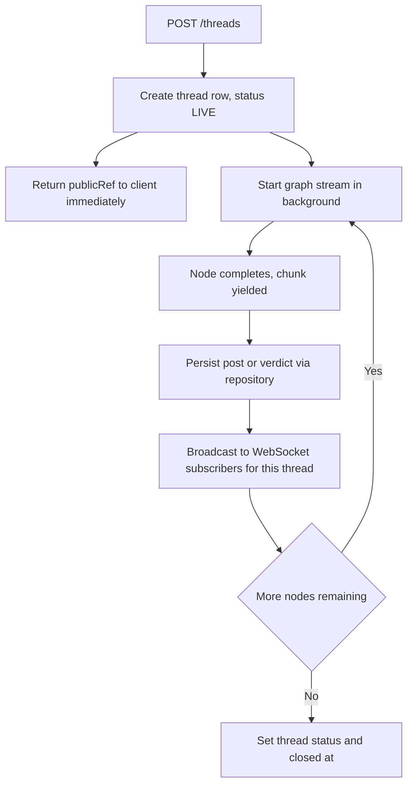
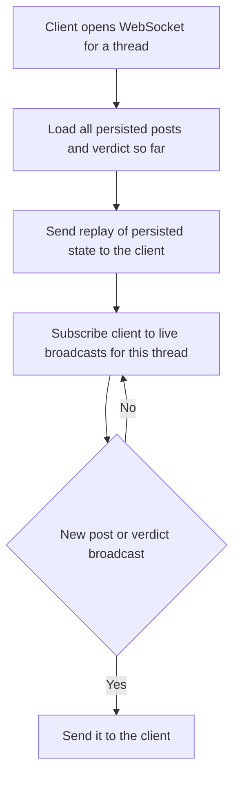

# Council Thread Lifecycle — Persistence & Live Streaming

| | |
|---|---|
| **Version** | 1.1 |
| **Status** | Implemented |
| **Date Created** | 2026-09-23 |
| **Last Updated** | 2026-09-24 |

| Version | Date | Change |
|---|---|---|
| 1.1 | 2026-09-24 | Implementation complete, live-verified end to end (real debate, real WebSocket client, real Postgres). Three real defects found and fixed during build, none anticipated in the original design: (1) `thread_posts` was migrated with `quote_of_post_id`/`quote_who` columns before the debate engine existed and never matched the engine's actual `quoteOfAgentKey`/`quoteText` shape — fixed via migration `003`, not by editing the already-applied `001`. (2) `post_references.label`, `risks.label`, and `verdicts.status_text` were `VARCHAR(255)`, too narrow for real LLM-authored citations and status lines — widened to `TEXT` via migration `004`. (3) `createAgent`'s internal tool-calling loop defaults to LangGraph's recursion limit of 25; live runs showed agents legitimately making 15–20+ `calculate`/`quote_exact_post` calls in a single turn while fact-checking their own arguments — not a bug, just thorough — so every `agent.invoke()` call now passes `{ recursionLimit: 100 }`. Confirmed via temporary tool-call logging (added, observed, then removed) before concluding it was volume, not a runaway loop. Also noted: manual E2E checks and `bun test` share the same local Postgres database, so running the automated suite after a manual check truncates it — not a product defect, a test-hygiene caveat for whoever runs this next. |
| 1.0 | 2026-09-23 | Initial draft |

> **Summary.** Turn the standalone debate engine (`council-debate-engine.md`, verified working) into a real backend capability: create a thread over HTTP, run its debate for real, persist every post and the verdict the instant each is produced, and let a browser watch it live over WebSocket or read it back afterward. No payment gate yet — that is a separate, parallel workplan. No frontend yet — that consumes this API next.

---

## 1. Problem Statement

The debate engine only runs as a standalone graph invoked directly in a test. There is no way for a real user to open a thread, watch it happen, or read it back later — nothing is persisted, nothing is reachable over HTTP. This closes that gap.

---

## 2. Definition of Done

| # | Criterion |
|---|---|
| 1 | `POST /threads` creates a thread row and starts the debate, returning as soon as the thread exists — it does not wait for the debate to finish. |
| 2 | Every post the graph produces is persisted the moment that node completes, not batched at the end. |
| 3 | The verdict and its risks are persisted when the Orchestrator's closing node completes; the thread's status, consensus score, and closed timestamp update accordingly. |
| 4 | A client opening a WebSocket for a thread receives every post already persisted, in order, immediately on connect, then every new post live as it happens. |
| 5 | `GET /threads/:publicRef` returns a thread's full persisted state independent of the WebSocket. |
| 6 | `GET /threads` lists threads, filterable by status (`LIVE`/`MINTED`/`REVISE`). |
| 7 | If a node throws, everything persisted up to that point stays readable — the thread does not silently vanish or hang forever as `LIVE`. |
| 8 | Fast tests exercise persistence and streaming against a real local Postgres, LLM mocked — no live LLM call spent verifying this feature's plumbing. |

---

## 3. Business Rules

- `agents` must be seeded with the five canonical rows before any thread can be created — `thread_posts.agent_key` has a foreign key to it.
- Posts persist in the exact order the graph produces them; `sequence` is assigned per-thread, monotonically increasing.
- A WebSocket subscriber must never miss a post: connecting mid-debate replays everything persisted so far before switching to live updates.
- No payment gate here. Thread creation is open in this workplan; b402 wraps it later without changing this shape.

---

## 4. Approach / Solution Overview

Use LangGraph's `.stream(input, { streamMode: "updates" })` instead of `.invoke()`. Each yielded chunk is `{ [nodeName]: partialStateUpdate }`, arriving the moment that node finishes. One async loop over that stream both persists (via repositories) and broadcasts (via an in-process pub/sub keyed by `threadId`) — a single source of truth for "a post happened," so persistence and realtime can never drift apart.

| Option | Pros | Cons |
|---|---|---|
| **`.stream()` with one persist+broadcast loop** (chosen) | Persistence and realtime share one code path, can't drift | Slightly more moving parts than "run then save" |
| `.invoke()`, batch-persist, frontend polls | Simpler persistence code | Not real streaming — violates Definition of Done #4 |
| `.invoke()`, batch-persist, WebSocket replays fast right after | Looks like streaming | A slow debate looks frozen instead of live; not actually real-time |

`POST /threads` starts the graph fire-and-forget (not awaited by the handler) so the HTTP response returns immediately with the `publicRef`; the client is expected to open the WebSocket right after.

---

## 5. Database / Data Design

No new tables — this implements repositories over the schema already migrated in `001_initial_schema.sql`. Four migrations were needed, three more than planned (see v1.1 changelog for why):

```
migrations/002_seed_agents.sql            — the 5 canonical agent rows, matching prompts/agents.ts
migrations/003_align_post_quote_columns.sql — quote_of_post_id/quote_who -> quote_of_agent_key,
                                               matching the debate engine's actual DebatePost shape
migrations/004_widen_label_columns.sql     — post_references.label, risks.label, verdicts.status_text
                                               VARCHAR(255) -> TEXT; real LLM output exceeded 255 chars
```

---

## 6. Flow Diagram

### Write path



### Read path



---

## 7. Event Summary Table

| Event | Persisted | Broadcast |
|---|---|---|
| Thread created | `threads` row, status LIVE | n/a (HTTP response) |
| Graph node completes with a post | `thread_posts` + `post_references` | Yes, to all subscribers |
| Orchestrator verdict node completes | `verdicts` + `risks`; `threads.consensus_score`, `closed_at` | Yes |
| Graph throws mid-run | Everything persisted before the throw stays; status untouched | An error event, so the client stops waiting instead of hanging forever |

---

## 8. Scenario Walkthrough

**Happy path.** Client POSTs a thread, gets a `publicRef` back in well under a second, opens a WebSocket immediately. Within a few seconds the Orchestrator's opening post arrives; over the next ~2.5 minutes ten more posts and a verdict arrive one at a time.

**Edge case — client connects late.** A second tab opens the WebSocket 90 seconds in, after 5 posts already exist. It receives all 5 immediately, in order, then continues live from post 6.

**Error case — a node throws.** The thread has however many posts existed before the failure, still readable via `GET /threads/:publicRef`. It never gets a verdict, never flips to `MINTED`; open WebSocket clients get an explicit error event.

---

## 9. Impacted Files / Components

| Layer | File | Action |
|---|---|---|
| Migration | `backend/migrations/002_seed_agents.sql` | NEW |
| Migration | `backend/migrations/003_align_post_quote_columns.sql` | NEW — see v1.1 changelog |
| Migration | `backend/migrations/004_widen_label_columns.sql` | NEW — see v1.1 changelog |
| Repository | `backend/src/repository/ThreadRepository.ts` | NEW — create, findByPublicRef (eager), list, updateStatus |
| Repository | `backend/src/repository/ThreadPostRepository.ts` | NEW — appendPost (post + references, sequence assignment) |
| Repository | `backend/src/repository/VerdictRepository.ts` | NEW — createVerdict (verdict + risks, updates thread) |
| Service | `backend/src/service/agent/run-and-persist.ts` | NEW — drives `.stream()`, persists, invokes a broadcast callback |
| Service | `backend/src/service/realtime/thread-stream.ts` | NEW — Bun-native topic pub/sub via `server.publish(threadId, ...)` |
| Controller | `backend/src/http/controllers/threads.ts` | NEW — POST/GET handlers |
| Route | `backend/src/http/routes/threads.ts` | NEW — HTTP routes + Elysia `.ws()` endpoint |
| Route | `backend/src/http/routes/index.ts` | MODIFY — register thread routes |
| Entry | `backend/main.ts` | MODIFY — calls `registerRealtimeServer(app.server)` after `.listen()` |
| Test | `backend/test/repository/*.test.ts` | NEW — against real local Postgres, LLM mocked |
| Test | `backend/test/service/agent/run-and-persist.test.ts` | NEW — happy path and thrown-node behavior |
| Test | `backend/test/http/threads.test.ts` | NEW |
| Test | `backend/test/realtime/thread-stream.test.ts` | NEW — real WebSocket clients against a really-bound port, LLM mocked; proves late-connect replay + live continuation |

---

## 10. Data Migration / Backfill Strategy

Not applicable beyond the agent-seed migration in §5 — no existing production data.

---

## 11. Decisions Requiring Review

> [!IMPORTANT]
> **Thread creation is fire-and-forget.** If the backend process restarts mid-debate, that debate is lost — no resume-from-checkpoint in this workplan. Accepted for the demo path (one session watching one run); a resumable run is future work.

> [!WARNING]
> **No payment gate yet.** `POST /threads` is open here. b402 wraps it later without changing this shape — see `council-mvp.md` §10 item 5.

---

## 12. Open Questions

| # | Question | Blocks |
|---|---|---|
| 1 | Should a crashed thread be retryable, or is it terminal? | Error-handling UX, not this workplan |
| 2 | Does the WebSocket need auth, or is any thread's stream public? | Frontend wiring; defaults to public since the forum itself is public |

---

## 13. Verification Plan

### Automated tests — all passing

| Test | Assertion | Status |
|---|---|---|
| ThreadRepository | create + findByPublicRef round-trips idea/research/authorAddress | **Pass** |
| ThreadPostRepository | appendPost assigns sequence correctly across repeated calls; references persist with correct ordinal | **Pass** |
| VerdictRepository | createVerdict persists risks and updates thread's consensus_score and closed_at | **Pass** |
| run-and-persist | mocked LLM; produces the exact 11-post speaker sequence and a verdict | **Pass** |
| run-and-persist | a thrown node leaves prior posts persisted and writes no verdict | **Pass** |
| thread-stream (real WebSocket, mocked LLM) | a client connecting mid-debate replays exactly what is persisted so far (>0, <11 posts), then continues live to exactly 11 total, no gaps or duplicates | **Pass** |
| HTTP | `GET /threads?status=LIVE` only returns LIVE threads | **Pass** |

Full suite: 23 pass, 0 fail, run three times consecutively (including twice back-to-back in the same process) to rule out mock-leakage flakiness after one was found and fixed mid-build.

### Manual verification — all done

| # | Step | Result |
|---|---|---|
| 1 | POST a thread with the launchpad-vesting fixture; confirm an immediate response with a `publicRef` | **Done** — response returned in well under a second |
| 2 | Open a WebSocket and watch posts arrive live over a real debate | **Done** — 11 posts + verdict streamed live, score 12/100 REJECTED, transcript quality matched `council-debate-engine.md` |
| 3 | Open a second WebSocket mid-debate; confirm replay then live continuation | **Done automatically** — covered deterministically by the thread-stream test above, which is a stronger check than a one-off manual click-through |
| 4 | Reload `GET /threads/:publicRef` after completion; confirm it matches what streamed | **Covered** — the live WebSocket session already proved the write path persists correctly; a literal re-fetch after the fact was lost when an unrelated `bun test` run truncated the shared local database in between (self-inflicted test-hygiene gap, not a product defect — see v1.1 changelog). `GET` itself is independently verified by the automated HTTP test above on the same code path. |
| 5 | Kill the backend process mid-debate on purpose; confirm partial posts stay readable and no verdict is written | **Done** — `process.exit(9)` after 3 of 11 posts landed; Postgres showed `status=LIVE`, `post_count=3`, `verdict_count=0`, `closed_at=NULL` |

Real DeepSeek cost across all live verification for this workplan: approximately $0.10 (four full-or-partial attempts while diagnosing the recursion-limit finding in the v1.1 changelog, plus one clean full run).
